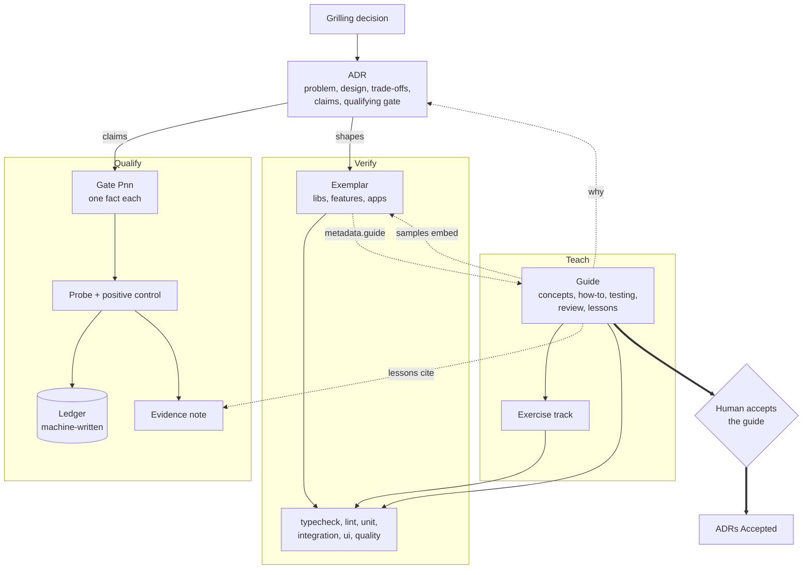
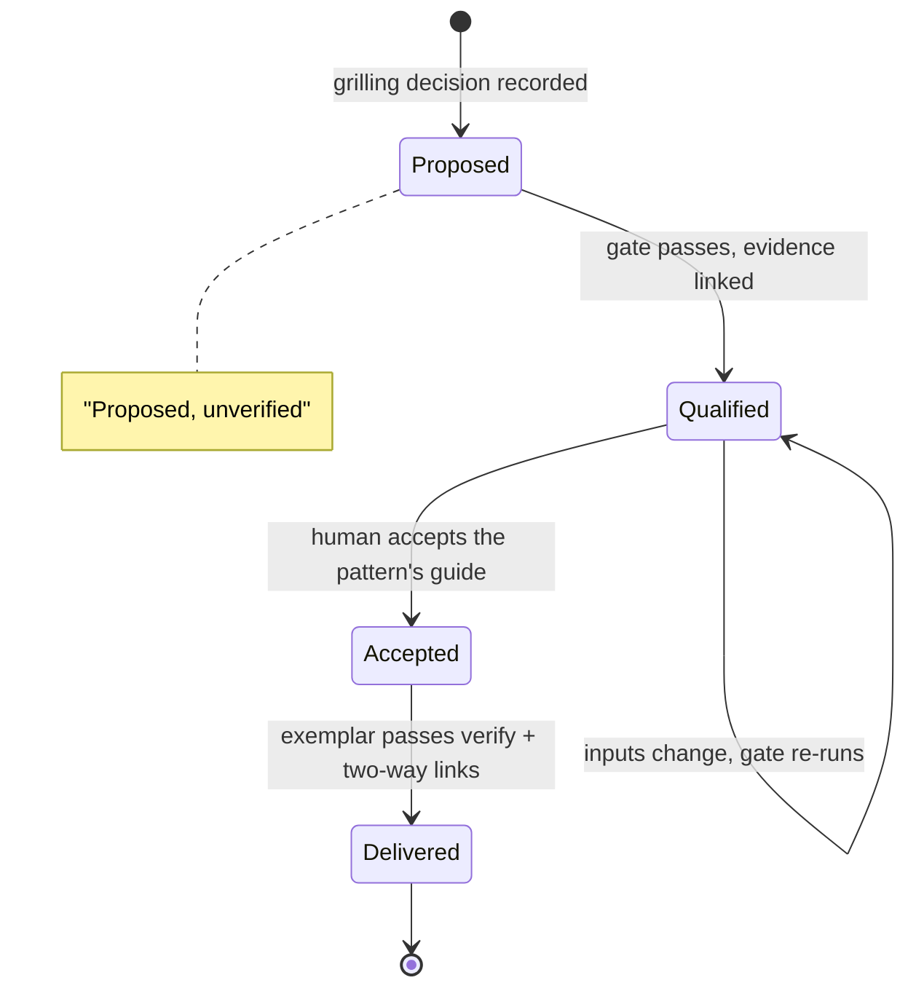
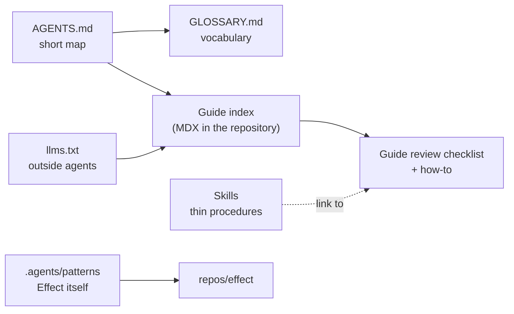

import Sample from '../../components/Sample.astro'

ViViEfs (Vision - View - Effects) is a reference stack for Expo apps and their
backend, built with Effect, durable execution and one datom log. This page
shows how everything built here fits together: patterns, ADRs, gates,
evidence, the exemplar and guides. The terms are defined in the
[glossary](/reference/glossary/); the process is
[ADR-0026](/reference/adr/0026-verify-qualify-teach/).

## The model in five sentences

1. A **pattern** is a reusable way of building something. Its ADRs record why
   it has this shape, and the claims it depends on.
2. **Qualify** proves those claims: each gate runs a retained probe with a
   positive control and writes the ledger, and a dated evidence note records
   the run. Then the ADR is Qualified.
3. **Verify** keeps the **exemplar**, the code that uses the pattern, true to
   its contract on every change: types, lint, and tests at the lowest layer
   that owns each behaviour.
4. **Teach** writes the pattern's **guide**: concepts, how-to, a review
   checklist, lessons that cite evidence, and samples and exercises that
   verify checks. When a human accepts the guide, its ADRs are Accepted.
5. A pattern is **delivered** when all three hold and the exemplar and the
   guide link to each other.

## Three questions, three mechanisms

Each question has its own tool, so a contract check never ends up in the
ledger, and a claim about the stack never ends up in every change.

| | Verify | Qualify | Teach |
| --- | --- | --- | --- |
| Question | Does the code keep its contract? | Is this claim about the stack true? | Can a person or an agent learn it from what we wrote? |
| Command | `pnpm verify`: `static -> unit -> integration -> ui -> quality` | `pnpm qualify`: numbered gates, an append-only ledger, one sequential full run | this site: guides, samples and exercises checked by `verify` |
| Needs | only the host: Node, a headless browser, in-process SQLite or PGlite | devices and lab containers as well | - |
| Proves | this code, at this commit | a fact we depend on, until its inputs change | nothing new: it explains, and points at what Verify and Qualify proved |

Claims come from gates, never from lessons. A lesson says "P05 showed X" and
links the evidence. If a lesson is wrong, fix the lesson. If the claim is
wrong, the gate fails.

## The map

Read it from top to bottom: a decision becomes an ADR, the ADR's claims go
through gates, the exemplar applies the pattern, and the guide ties it
together for people and agents. Dashed arrows are links that `verify`
checks.

## The lifecycle of an ADR

Before a guide is recorded as accepted, its gates run and pass on that
commit. Most ADRs that are not patterns are accepted on one of three guides
of their own: working in ViViEfs, Verify - Qualify - Teach, and the stack
baseline (D63, D65). Each ADR's status is shown next to it under
[ADRs](/reference/adr/).

## Every piece

| Piece | What it is | Where | Checked by |
| --- | --- | --- | --- |
| Decision | An answer from a grilling | `docs/plan/bootstrap/02-decision-log.md` | - |
| ADR | The why of a decision, its claims and its qualifying gate | [ADRs](/reference/adr/) | status moves only with evidence or acceptance |
| Pattern | A reusable way of building; one or more ADRs | a guide and an exemplar | the delivery definition |
| Gate and probe | One fact, a rerunnable probe, a positive control | `tools/qualification` | `pnpm qualify` |
| Ledger | Append-only record of gate runs | `tools/qualification/gate-ledger.json` | fingerprints; stale when an input changes |
| Evidence note | Dated, sanitized record of a run | [Evidence](/reference/evidence/) | from P09 on, the committed diagram equals the run |
| Exemplar | The evidence-collection stack, which uses every pattern | `libs/`, `features/`, `apps/` | `pnpm verify` |
| Guide | Everything needed to discuss, design, implement and review with a pattern | [Guides](/guides/) | guide template, links |
| Concept page | The model and vocabulary; links ADRs as the why | in the guide | links |
| Sample | Code embedded from the exemplar by region, or a teaching snippet | the exemplar, `apps/docs/src/samples/` | `tsc` 7 with Effect diagnostics, lint, Vitest |
| Lesson | One key idea taught step by step; cites evidence | in the guide | links to evidence resolve |
| Exercise | `problem/` (must fail) and `solution/` (must pass), one test | `exercises/<pattern>/` | `verify` |
| `llms.txt` | Generated index for agents outside the repository | [`/llms.txt`](/llms.txt) | site build |

## One pattern end to end: the log store

The same chain as the map, filled in for the first guide.

- **Decisions** D31, D33' and D37: one datom log as the single substrate, a
  hybrid logical clock for `tx`, and an append-only datom table with indexes
  and typed read models.
- **ADRs**: ADR-0006, ADR-0007, ADR-0011.
- **Gates**: P04 and P05, each linked to its
  evidence note.
- **Exemplar**: `libs/datom` and the four store projects. `verify` runs the
  conformance suite against sqlite-node and Postgres in `integration`;
  qualify runs it against every implementation.
- **Guide**: [Log store](/guides/log-store/), a draft: concepts, how-to
  ("add a store implementation"), testing, the review checklist, four lessons
  and the exercise track in `exercises/log-store`.

A datom is one fact: entity, attribute, value, the transaction's hybrid
logical clock, assert or retract, and the changeset it belongs to. This is
the exemplar's own definition, embedded from its source:

<Sample path="libs/datom/src/schema.ts" region="datom" />

## Where agents plug in

There is one source (D30). Agents in the repository read the guides' MDX
sources; agents outside it read `llms.txt`. A guide's review checklist is
what an agent reads before it changes code that uses the pattern, and what a
reviewer checks the change against.

The grilling overview this page comes from, with the drift audit and the
measured costs of verify and qualify, is kept as a research record:
[How a pattern is delivered, 2026-09-29](/research/2026-09-29-delivery-model.html).
