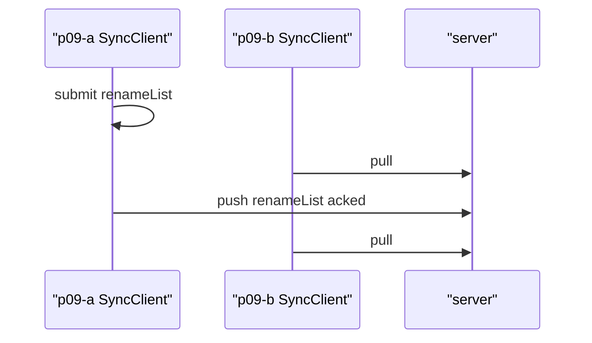
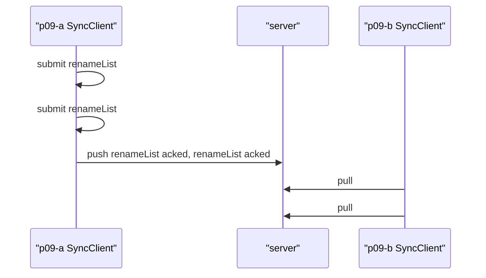
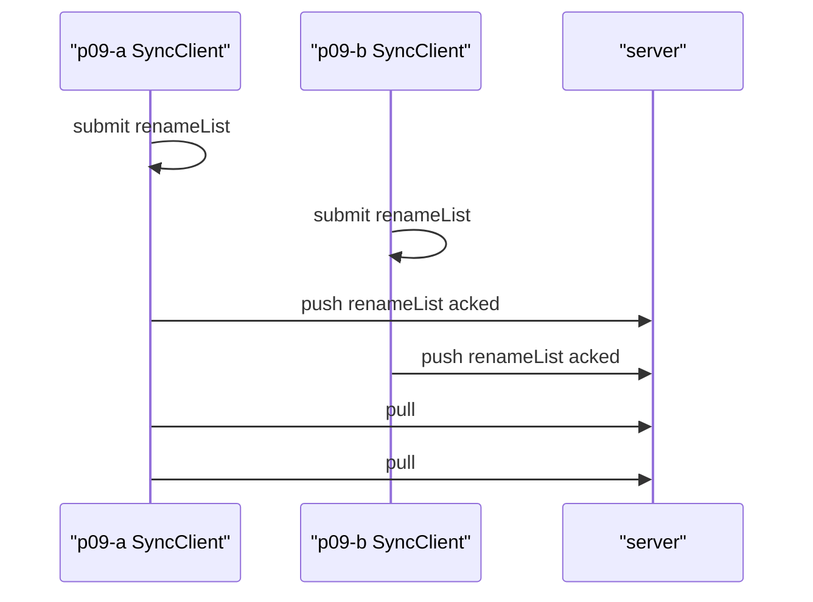
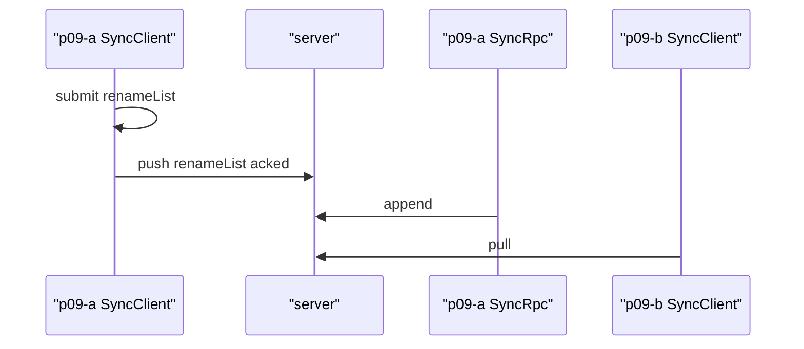
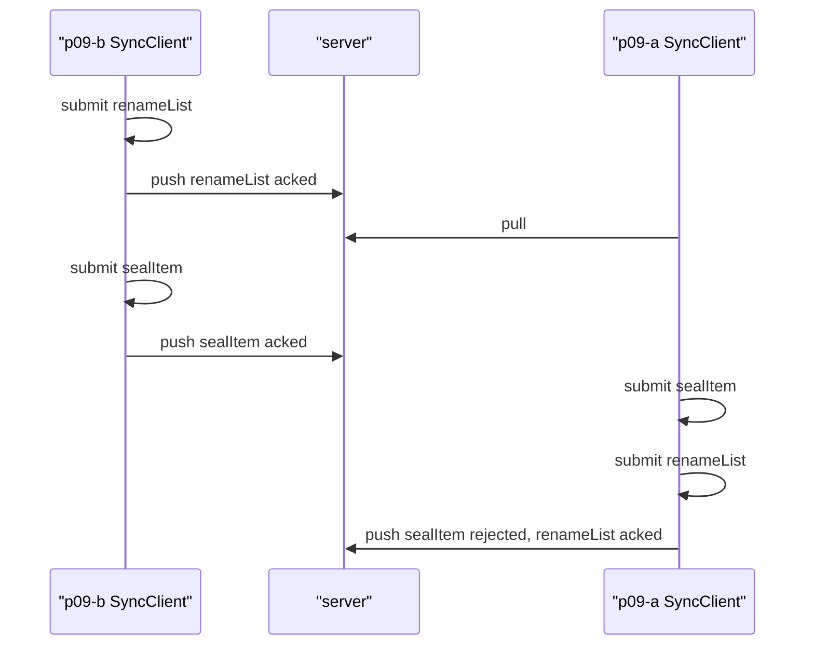
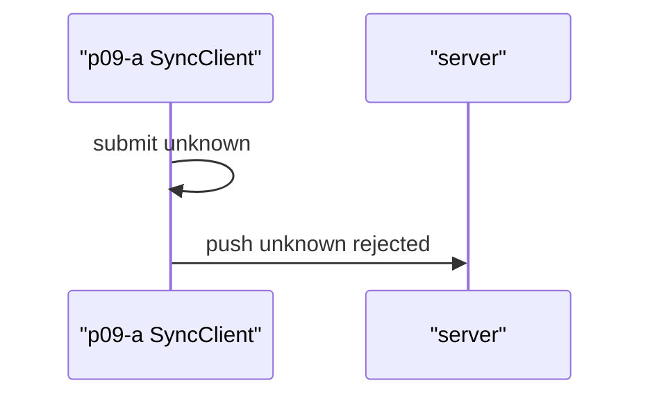
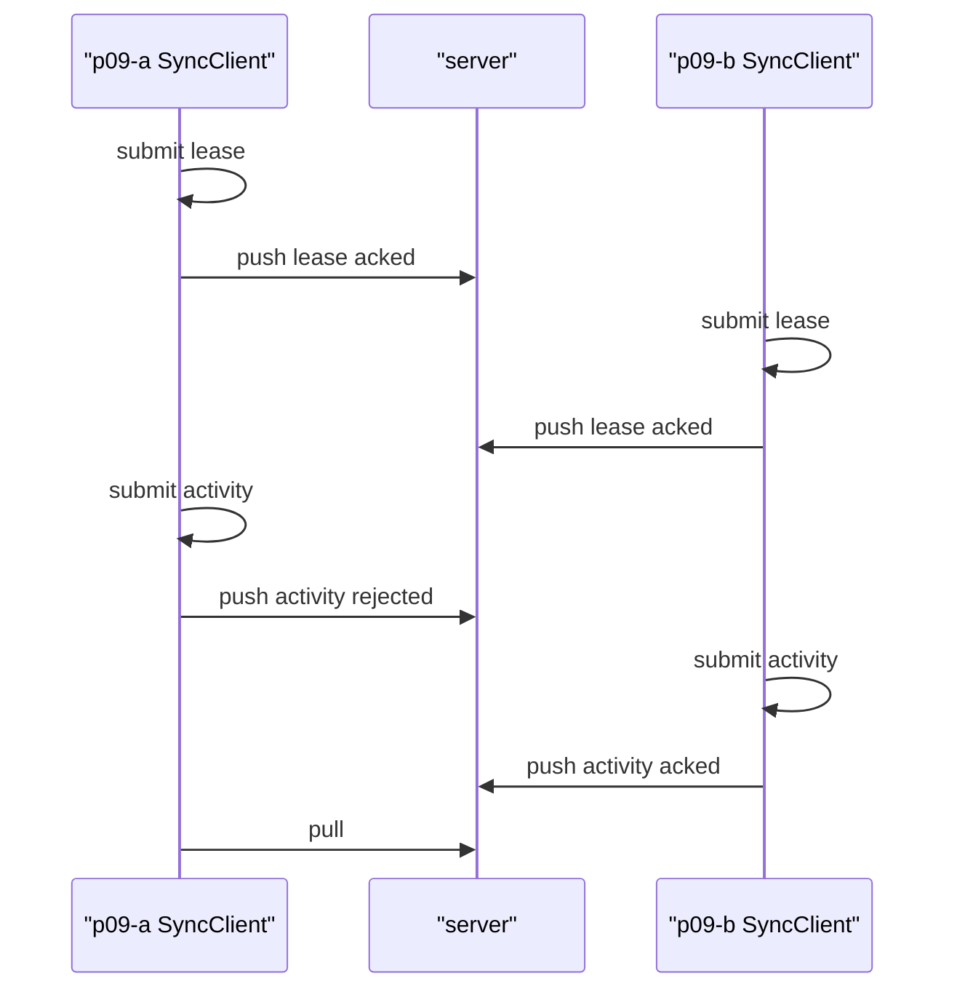
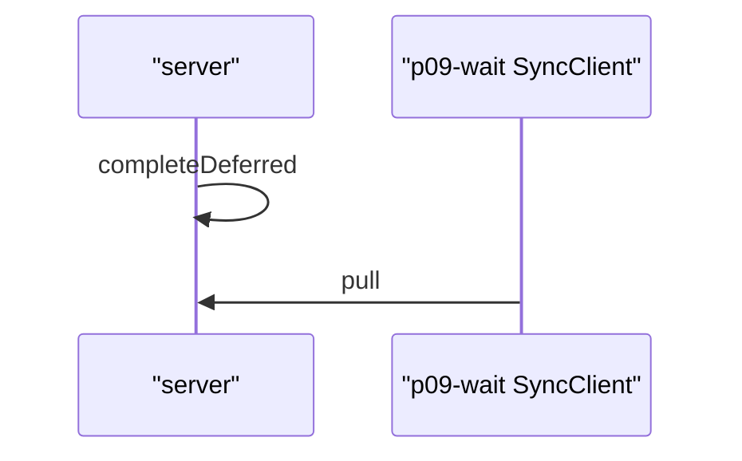
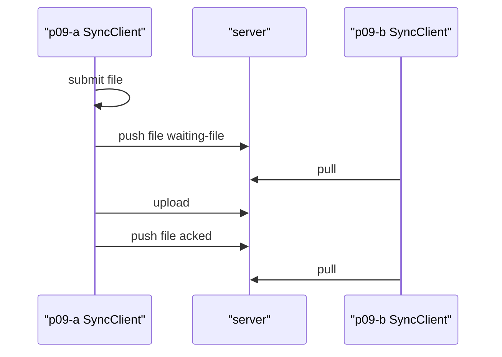
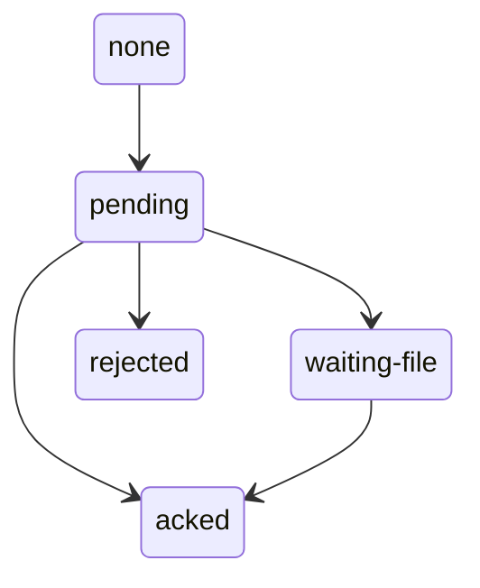

# P09 sync — 2026-09-22

Ledger: pass at `2026-09-22T13-18-45.675Z-a314ca28` (dirty tree on `c64a32d0`).
Bulky artifacts: `.artifacts/qualification/p09` (gitignored).

P09 is a Node probe on sqlite-node. iOS, Android and web are not part of this gate.

## Picks

- Protocol package `@viviefs/sync-protocol` (`layer:core`, `platform:universal`) so the client and server adapters do not depend on each other.
- RPCs: `Append` (ack `{cursor}`), `Pull` (one finite `PullPage` per call), `PutBlob`.
- Device tables: `outbox` (`cs` unique, state `pending` / `waiting-file` / `acked` / `rejected`) and `sync_cursor` (`org`, server `seq`).
- File names stay `blob:` plus sha256 hex. The P09 blob store is in memory.
- The server validates the received changeset and appends it. It does not re-execute the command.
- A self-committed journal write is stored on the device only after the server acks it.
- An open changeset that the server rejects gets a local abort, then the projector rebuilds and the rest of the outbox is pushed.
- `FileMissing` leaves the outbox in `waiting-file`. The changeset is not aborted.
- Quarantine after a lost lease is still an empty named slot. Conflict rows stay in `projection_conflicts`.

## Checks

Nine checks, all pass. The positive control is the stale lease: device A's epoch-1 activity exit is `StaleLease`; device B's epoch-2 exit is accepted, and A's later pull sees only B's exit.

| Check | Result |
| --- | --- |
| outbox offline | pass (local draft, then one ack, peer sees the title) |
| cursor stream | pass (one pull, second pull holds the cursor) |
| full organization | pass (acme pull does not contain the other org) |
| duplicate append | pass (second append of the same `tx` acks) |
| typed rejection rebuilds | pass (`BasisRejected`, rebuild, remaining outbox acked) |
| unknown attribute | pass (`UnknownAttribute`) |
| stale lease rejected | pass (holder `p09-b`) |
| server deferred completion | pass (server-authored deferred exit resumes the device workflow) |
| file manifest waits | pass (hidden until `PutBlob`, then the hash is visible) |

## Review

A command in [`features/evidence/model`](../../features/evidence/model/src/command.ts) returns one changeset. [`renameList`](../../features/evidence/model/src/command.ts#L80) is that command for a list title: it checks the title, then returns the datoms. `submit` stores the changeset on the device. `push`, `pull`, `upload`, and `append` talk to the server. The server stores the changeset or rejects it, and it does not run the command again. Sending the same `tx` again acks and does not add a second row. [ADR-0017](../adr/0017-sync-outbox-and-cursor-stream.md).

A lifeline is a service: `p09-a SyncClient`, `p09-a SyncRpc` when the probe calls `append` itself, and one [`server`](../../libs/sync/server/src/server.ts). `submit` stays on the client. `push`, `append`, `pull`, `upload`, and `completeDeferred` are arrows. The pull inside `push` stays on the push arrow. The paragraph under each title is the comment on that check, and the link opens that comment. The state diagram is the set of outbox transitions. The diagrams are the probe's `Effect.fn` spans. The probe fails when a later run draws a different picture.

Read the probe before the adapters.

| Question | File |
| --- | --- |
| What was measured? | this note |
| Why these choices? | Observed sections of [ADR-0017](../adr/0017-sync-outbox-and-cursor-stream.md), [ADR-0016](../adr/0016-commands-and-server-validation.md), [ADR-0014](../adr/0014-leases-fencing-and-server-authority.md), [ADR-0021](../adr/0021-files-by-content-hash.md), [ADR-0015](../adr/0015-deferreds-vs-machines.md) |
| What is on the wire? | [`libs/sync/protocol/src/rpc.ts`](../../libs/sync/protocol/src/rpc.ts) |
| What is a write? | [`features/evidence/model/src/command.ts`](../../features/evidence/model/src/command.ts) |
| What does the device do? | [`libs/sync/client/src/client.ts`](../../libs/sync/client/src/client.ts) |
| What does the server accept? | [`libs/sync/server/src/server.ts`](../../libs/sync/server/src/server.ts) |
| What ran? | [`tools/qualification/src/probes/p09-checks.ts`](../../tools/qualification/src/probes/p09-checks.ts) |

Copy these seams: the protocol package between the two adapters, one command that returns a changeset, outbox states `pending` / `waiting-file` / `acked` / `rejected`, self-committed journal writes that stay off the device log until ack, and a server-authored deferred exit. Quarantine and conflict-datom append are still empty slots.

<!-- span-review:start -->
**outbox offline.** `renameList` sets a list title and returns one changeset. Here the title is `local`. `submit` stores that changeset on A, so A's draft shows it and B's `pull` does not. After A pushes, the server has acked it, and B's next `pull` shows `local`. [outboxOffline](../../tools/qualification/src/probes/p09-checks.ts#L266) · [SyncClient](../../libs/sync/client/src/client.ts) · [server](../../libs/sync/server/src/server.ts)

**cursor stream.** `renameList` creates two lists, `one` and `two`. One `pull` returns both. The next `pull` returns nothing new and keeps the same server cursor. [cursorStream](../../tools/qualification/src/probes/p09-checks.ts#L314) · [SyncClient](../../libs/sync/client/src/client.ts) · [server](../../libs/sync/server/src/server.ts)

**full organization.** A `renameList`s a list in organization `acme`. B `renameList`s a list in organization `other`. A's `pull` of `acme` shows `acme` and does not show `other`. [fullOrganization](../../tools/qualification/src/probes/p09-checks.ts#L359) · [SyncClient](../../libs/sync/client/src/client.ts) · [server](../../libs/sync/server/src/server.ts)

**duplicate append.** `renameList` sets the list title to `once` and returns one changeset. `submit` stores it on A. `push` sends it to the server, which acks it. `append` sends that same changeset again, with the same `tx`. The server acks and does not write a second title. B's `pull` shows the title once. [duplicateAppend](../../tools/qualification/src/probes/p09-checks.ts#L413) · [SyncClient](../../libs/sync/client/src/client.ts) · [server](../../libs/sync/server/src/server.ts)

**typed rejection rebuilds.** B `renameList`s the list to `box` and `sealItem` sets the item seal to `gold`. Both pushes ack. A then submits a `sealItem` of `silver` and a `renameList` to `kept`. One `push` rejects `silver` because the seal is write-once, rebuilds, and acks `kept`. The committed seal stays `gold`. [typedRejection](../../tools/qualification/src/probes/p09-checks.ts#L457) · [SyncClient](../../libs/sync/client/src/client.ts) · [server](../../libs/sync/server/src/server.ts)

**unknown attribute.** The changeset asserts `evidence/not-shipped`, which is not in the catalog. The server rejects the whole changeset with `UnknownAttribute`. The attribute is not stored. [unknownAttribute](../../tools/qualification/src/probes/p09-checks.ts#L530) · [SyncClient](../../libs/sync/client/src/client.ts) · [server](../../libs/sync/server/src/server.ts)

**stale lease rejected.** A takes the lease at epoch 1. B takes it at epoch 2. A's activity exit at epoch 1 is rejected. B's exit at epoch 2 is acked. A's later `pull` shows only B's exit. [staleLease](../../tools/qualification/src/probes/p09-checks.ts#L584) · [SyncClient](../../libs/sync/client/src/client.ts) · [server](../../libs/sync/server/src/server.ts)

**server deferred completion.** The device runs a workflow that is waiting on a deferred. `completeDeferred` is the server writing that deferred's exit. The server does not run the workflow. The device `pull`s the exit and the workflow finishes. [serverDeferred](../../tools/qualification/src/probes/p09-checks.ts#L672) · [SyncClient](../../libs/sync/client/src/client.ts) · [server](../../libs/sync/server/src/server.ts)

**file manifest waits.** The changeset names a file hash in its manifest. The server answers that the file is missing, so the push stays `waiting-file` and B does not see the file. After `upload`, the same changeset pushes and is acked. B's `pull` shows the hash. [fileManifest](../../tools/qualification/src/probes/p09-checks.ts#L718) · [SyncClient](../../libs/sync/client/src/client.ts) · [server](../../libs/sync/server/src/server.ts)

**Outbox.** The transitions recorded on `SyncClient.outbox` spans. [SyncClient](../../libs/sync/client/src/client.ts)

<!-- span-review:end -->
