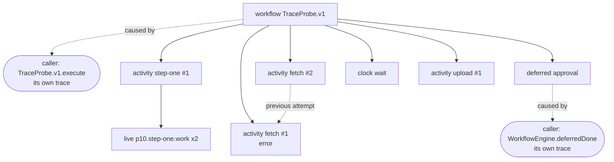

# P10 trace projection - 2026-09-26

Ledger: not yet recorded. `pnpm qualify --gate P10` fills this line.
Bulky artifacts: `.artifacts/qualification/p10` (gitignored).

P10 is a host probe: sqlite-node and Postgres via PGlite, with the three sinks on this Mac. It does not run the projector on iOS, Android or web (choice F in the [design review](p10-design-review.md)). P03 measured OTLP from Hermes.

## Picks

- Journal attribute (D44): `viviefs/activity/started`, write-once, value `{name, attempt}`, in the activity entity type. `viviefs/activity/exit` stays the defining attribute.
- Entity-keyed ids: span id = first 16 hex of SHA-256 over the journal entity id; trace id = first 32 hex over the execution entity id (`@noble/hashes` 2.4.0, MIT). One trace per execution.
- Causing span: an envelope names the caller's live span for a start, a lease grant or handoff, and a deferred completed from outside; the engine's own writes name their durable span; a clock-fired deferred exit names the clock's span.
- Span names: `workflow <name>`, `activity <name> #<attempt>`, `clock <name>`, `deferred <name>`. Deferred spans have zero length.
- Trace cursor: `trace_cursors(sink, seq)`, one row per sink, advanced only after the sink acknowledged. Delivery is at least once.
- Export: Effect's `OtlpSerialization.layerJson` and `HttpClient`, posted by the projector. Not Effect's batching `OtlpTracer`.
- Lab images, pinned by digest in [`lab-images.json`](../../tools/qualification/lab-images.json): Jaeger 2.20.0 and otel-lgtm 0.33.1. otel-lgtm bundles AGPL components and runs as a local viewer only.

## Checks

| Group | Check | sqlite-node | Postgres |
| --- | --- | --- | --- |
| engine | start fact once per attempt | | |
| engine | killed body keeps its first start | | |
| engine | caller causing span | | |
| engine | engine causing span | | |
| engine | live spans only in activity bodies | | |
| projection | one trace | | |
| projection | deterministic ids | | |
| projection | no duplicates on replay | | |
| projection | attempts linked | | |
| projection | failed send keeps the cursor | | |
| projection | disabled trace cursor keeps the backlog (positive control) | | |

| Sink | Check |
| --- | --- |
| motel | |
| Jaeger | |
| otel-lgtm | |

## Review

One execution of `TraceProbe.v1` ([`trace-scenario.ts`](../../libs/testing/src/trace-scenario.ts)): `step-one` is killed after its body ran and before its exit was journaled, a launch sweep resumes it, `fetch` fails on attempt 1 and succeeds on attempt 2, a caller completes `approval`, a durable clock fires, and `upload` finishes. The trace projector derives the durable spans from that journal.

The picture below is drawn from the probe's run. Solid arrows are parents. Dashed arrows are span links. Rounded nodes are callers on their own trace. The probe fails when a later run draws a different picture.

| Question | File |
| --- | --- |
| What was claimed and decided? | [p10-design-review.md](p10-design-review.md), [ADR-0018](../adr/0018-tracing-and-telemetry-sinks.md) |
| Which facts become which spans? | [`durable-spans.ts`](../../libs/telemetry/src/durable-spans.ts) |
| When does the cursor move? | [`trace-projector.ts`](../../libs/telemetry/src/trace-projector.ts) |
| What does the engine write? | [`trace.ts`](../../libs/workflow-engine/src/trace.ts), [`engine.ts`](../../libs/workflow-engine/src/engine.ts) |
| What ran? | [`trace-scenario.ts`](../../libs/testing/src/trace-scenario.ts), [`trace-projection.ts`](../../libs/testing/src/trace-projection.ts), [`p10-checks.ts`](../../tools/qualification/src/probes/p10-checks.ts) |

<!-- span-review:start -->

<!-- span-review:end -->

To look at a run in the sinks, run the probe with `P10_KEEP_SINKS=1`. It prints the Jaeger trace URL (`http://127.0.0.1:26686/trace/<traceId>`) and leaves Jaeger and otel-lgtm running. Grafana is on `http://127.0.0.1:23000` (Explore, Tempo, TraceQL: the trace id).

## Findings on the way

- PGlite 0.5.8 `close()` does not wait for its query mutex. A session closed under an in-flight query spun the WASM on the main thread, and P06 hung in about half its PGlite runs. Fixed in `a7857e4fb` (drain before close).
- The engine journals a failed activity as the printed cause (`Cause([Fail("flaky")])`), not the typed error. The span reports what the journal holds. Open item.
- A clock-fired deferred exit first named the deferred's own span, which is never drawn. It now names the clock span.

## Not measured here

- The projector on iOS, Android or web.
- Honouring the envelope's `sampled` flag (recorded, ignored; named slot).
- The trace cursor holding back compaction (`LogStore.compact` uses `device_cursors` only; named slot).
- A batch limit on `streamFrom` for a large backlog.
- P07 on devices with the changed engine (live tracing is now off in workflow bodies). Re-run at foundation closure.
