# P11 identity - 2026-09-28

Ledger: pass at `2026-09-28T19-38-22.564Z-0f0ac08c` (clean tree on `971ae6e2`, recorded 2026-09-28T19:48:31Z). The other gates are stale in the ledger (its fingerprint covers every lib) until the sequential P01-P11 run.
Bulky artifacts: `.artifacts/qualification/p11` (gitignored).

Measurement run: `tools/qualification/src/probes/p11.ts` run directly on 2026-09-28 (dirty tree on `d3e7d5de`, no ledger entry), all sections pass in about 10 minutes: the token contract on the fake and the Node checks 2 s, starting Keycloak and the server plus the Keycloak and HTTP sections 24 s, iOS 4 min, Android 3 min, web 47 s, the three controls 2 min.

P11 runs on this Mac: Node for the token contract, the protocol checks and the HTTP leg; Keycloak 26.7.3 on Apple Container (pinned by digest in [`lab-images.json`](../../tools/qualification/lab-images.json)); the evidence server (`apps/evidence-server`, PGlite) over HTTP; the evidence app as a development build on the iOS simulator and the Android emulator, and as Expo web in Chromium. One issuer, `http://localhost:28080/realms/viviefs`, on every platform (Android through `adb reverse`).

## Picks

- Two services under the identity pattern: `TokenVerifier` on the server (`oidcTokenVerifier`: `jose`, OIDC discovery, cached JWKS, no introspection) and `SignInSession` on the device (`oidcSignInSession`: authorization code with PKCE S256, refresh, revocation at sign out). No `Identity` class ([ADR-0022](../adr/0022-identity-and-organization-isolation.md)).
- `FakeIssuer` signs real JWTs with a local key and serves its own JWKS; only tests, `tools/` and dev composition import it (`libs/testing`, `layer:testing`).
- `BearerAuthentication` on the whole sync RPC group. Membership, actor, lease and server-only attributes are checked in the handlers; membership is the entity `O{org}/M{person}` in the organization's log, read on every request.
- The account entity `A{sha256(iss, sub)}` under a server-only root maps a provider account to a person. Only `grantMembership` mints a person.
- The device learns who it is from the server: the `Caller` RPC's statement (person or none, organizations), kept in the sign-in session (Q22).
- Token storage: iOS and Android keep the refresh token in `expo-secure-store` with `offline_access`; web keeps tokens in memory only. Every sign-in asks for the password (`prompt=login`), and iOS uses an ephemeral authentication session.
- One local replica per provider account, named from a 96-bit hash of `(iss, sub)`. Removing the account deletes it.
- Lab: `viviefs-mobile` access tokens live 30 s, so a revoked session shows up within a run; a bootstrap admin revokes a user's sessions for check 10.

## Checks

The claim's positive control holds on Node, over HTTP and on every device: a member of `acme` is acked while the same token asking for `other` gets `MembershipMissing`.

### 1. Token contract

The same nine checks ([`token-verifier-conformance.ts`](../../libs/identity/src/suites/token-verifier.ts)) on three verifier and issuer pairs. All pass.

| Check | Fake verifier on the fake | OIDC verifier on a served fake | OIDC verifier on Keycloak |
| --- | --- | --- | --- |
| valid token | pass | pass | pass (alice's pinned subject; roles `member`, `offline_access`, `default-roles-viviefs`, `uma_authorization`) |
| missing token | pass (`missing`) | pass (`missing`) | pass (`missing`) |
| changed payload | pass (`invalid`) | pass (`invalid`) | pass (`invalid`) |
| alg none | pass (`invalid`) | pass (`invalid`) | pass (`invalid`) |
| foreign key | pass (`invalid`) | pass (`invalid`) | pass (`invalid`) |
| algorithm confusion | pass (`invalid`) | pass (`invalid`) | pass (`invalid`) |
| foreign issuer | pass (`invalid`) | pass (`invalid`) | pass (`invalid`, a token from the realm `viviefs-other`) |
| foreign audience | pass (`invalid`) | pass (`invalid`) | pass (`invalid`, a `viviefs` token issued to another client) |
| expired | pass (`expired`) | pass (`expired`) | pass (`expired`) |

### 2. Node checks on the authenticated protocol

A fake issuer, one server on sqlite-node, devices A (member of `acme`), B (`other`) and others per check ([`p11-checks.ts`](../../tools/qualification/src/probes/p11-checks.ts)). All 12 pass.

| Check (design review #) | Measured |
| --- | --- |
| cross-organization denied (3) | A acked in `acme`; `Append`, `Pull`, `PutBlob`, `CompleteDeferred` for `other` all `MembershipMissing`; B completes the deferred in `other` |
| never granted | a valid token with no membership: `Pull` `MembershipMissing`, no person minted |
| lease (4) | B's lease on an `acme` execution `MembershipMissing`; A's acked; the server holds 1 holder |
| actor (5) | envelope naming B's person and `server`: `ActorMismatch` twice; A's own person acked |
| server-only attributes (6) | a client-written membership datom: `ServerOnlyAttribute`; B is still not a member |
| server-only root (12) | A's pull holds its membership and 0 account datoms; a client-written account entity: `ServerOnlyAttribute` |
| revocation (7) | after `revokeMembership` with a still-valid token: the pending row `rejected` (`MembershipMissing`) and kept; a new local change refused (`MembershipMissing`); after a new grant A writes again |
| acceptance time (8) | a device claim of `acceptedAt: 5` is dropped from the outbox and the local log; the server stamps its clock within the push; the device's log then holds the server's value |
| blobs per organization (9) | the hash A uploaded to `acme` is `FileMissing` for B in `other` until B uploads it there; A cannot upload to `other` (`MembershipMissing`) |
| missing token | no token: `TokenRejected missing`; not a token: `TokenRejected invalid` |
| sign-in needed keeps outbox (10, host side) | `push` fails with `SignInNeeded` before any request; the row stays `pending` |
| caller statement | A: `[acme]`; after a grant in `other`: `[acme, other]`; after `acme` is revoked: `[other]`; never granted: no person |

Positive controls, run once in step 3 and recorded in the [design review](p11-design-review.md): removing the membership check fails 5 of these checks, removing the actor check fails `actor`, keeping a client's `acceptedAt` fails `acceptance time`, ignoring revocations fails exactly `caller statement`.

### 3. Over HTTP with Keycloak's tokens

The lab's evidence server verifies Keycloak's tokens by discovery and JWKS; alice is granted `acme` by her pinned id, bob nothing ([`p11-http.ts`](../../tools/qualification/src/probes/p11-http.ts)). All 4 pass.

| Check | Measured |
| --- | --- |
| member acked over HTTP | alice's statement names her subject, a person and `[acme]`; her `Append` acked (cursor 8); `Pull` returns the envelope with her person and a server `acceptedAt` |
| cross-organization denied over HTTP | the same token for `other`: `Append` and `Pull` `MembershipMissing` |
| never granted over HTTP | bob's statement has no person and no organizations; his `Pull` of `acme` `MembershipMissing` |
| foreign issuer refused over HTTP | a genuine token from the realm `viviefs-other`: `TokenRejected invalid` |

### 4. Device checks

One scenario on each platform ([`p11-device.ts`](../../tools/qualification/src/probes/p11-device.ts)); the driver taps controls and types into Keycloak's login page, and the app publishes what it holds. All 6 pass on each platform.

| Check (design review #) | iOS simulator | Android emulator | Web (Chromium) |
| --- | --- | --- | --- |
| PKCE sign-in (2) | pass | pass | pass |
| cross-organization denied on the device (3) | pass | pass | pass |
| token storage (Q9) | pass: a restart keeps the session from secure storage; the next push refreshed and was acked | pass: same | pass: a reload signs out; signing in finds the same replica |
| sign-in needed keeps the outbox (10) | pass: `invalid_grant` after an admin revoked alice's sessions; the pending write was acked after signing in again | pass | pass |
| local replica per provider account (11) | pass: bob's replica empty; alice's rows and pending write intact and synced | pass | pass |
| removing the account deletes its replica (Q11) | pass: signing in again starts empty and pulls from the server | pass | pass |

In PKCE sign-in the device learns alice's person from the server's statement, pushes to `acme` and is acked; cross-organization, the same token for `other` is `rejected MembershipMissing`, and `other` is read-only afterwards while `acme` is unaffected.

### 5. Positive controls for the device checks

Each control is a lab-only defect in the evidence app ([`p11-control.ts`](../../apps/evidence-mobile/src/p11-control.ts)), switched on by `EXPO_PUBLIC_P11_CONTROL` and shown on the screen. The probe runs each on web and requires the targeted check to be the first failure, after the checks before it passed. All 3 fail as required.

| Control | Fails | Observed |
| --- | --- | --- |
| `ignore-invalid-grant`: refusals from the token endpoint become transport failures | sign-in needed keeps the outbox | the session stays `SignedIn` and every sync answers `IdentityProviderUnreachable ... 400`: a dead session retried forever |
| `shared-replica`: every account opens the same replica | local replica per provider account | bob, a member of nothing, sees alice's 33 `acme` rows and her pending write |
| `persistent-web-vault`: web keeps the session in `localStorage` | token storage | after a reload the app is still signed in as alice |

## Review

The Node checks run the authenticated sync protocol in one process: a fake issuer signs real tokens, `BearerAuthentication` verifies them, and the handlers check membership, actor, lease and server-only data. The device checks run the same protocol over HTTP from the evidence app to `apps/evidence-server`, with Keycloak as the identity provider.

A lifeline is a service: `p11-a SyncClient`, `p11-a SyncRpc` when the probe calls an RPC itself, one [`server`](../../libs/sync/server/src/server.ts), and `operator` for `grantMembership` and `revokeMembership` once a check is under way (the grants that set a check up are in its paragraph). An arrow carries the refusal it met. A call that no server span continued never left the device and stays on its lifeline, like the push with `SignInNeeded`. The paragraph under each title is the comment on that check, and the link opens that comment. The diagrams are the probe's spans; the probe fails when a later run draws a different picture.

Read the probe before the adapters.

| Question | File |
| --- | --- |
| What was claimed and decided? | [p11-design-review.md](p11-design-review.md), [ADR-0022](../adr/0022-identity-and-organization-isolation.md) |
| How is a token checked? | [`token-verifier.ts`](../../libs/identity/src/token-verifier.ts), [`oidc.ts`](../../libs/identity/src/oidc.ts), the contract in [`token-verifier-conformance.ts`](../../libs/identity/src/suites/token-verifier.ts) |
| How does a device sign in? | [`oidc-sign-in-session.ts`](../../libs/identity/src/oidc-sign-in-session.ts), the Expo ports in [`sign-in.ts`](../../libs/platform-native/src/sign-in.ts) |
| What does the server enforce? | [`libs/sync/server/src/server.ts`](../../libs/sync/server/src/server.ts) |
| What ran on Node? | [`p11-checks.ts`](../../tools/qualification/src/probes/p11-checks.ts), [`p11-http.ts`](../../tools/qualification/src/probes/p11-http.ts) |
| What ran on the devices? | [`p11-device.ts`](../../tools/qualification/src/probes/p11-device.ts), the app side in [`p11-runtime.ts`](../../apps/evidence-mobile/src/p11-runtime.ts) and the controls in [`p11-control.ts`](../../apps/evidence-mobile/src/p11-control.ts) |

<!-- span-review:start -->
**cross-organization denied.** The positive control. A pushes a list title to `acme`, its own organization, and the server acks. The same token asking for `other` gets `MembershipMissing` on `Append`, `Pull`, `PutBlob` and `CompleteDeferred`. B, a member of `other`, completes a deferred there. [crossOrganization](../../tools/qualification/src/probes/p11-checks.ts#L118) · [SyncClient](../../libs/sync/client/src/client.ts) · [server](../../libs/sync/server/src/server.ts)

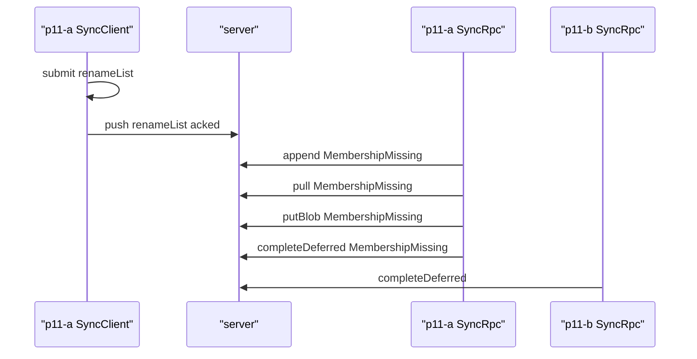

**never granted.** C signs in with a valid token but was never granted membership anywhere, so it has no person. Its `pull` of `acme` gets `MembershipMissing`, and the server mints no person for it. [neverGranted](../../tools/qualification/src/probes/p11-checks.ts#L150) · [SyncClient](../../libs/sync/client/src/client.ts) · [server](../../libs/sync/server/src/server.ts)

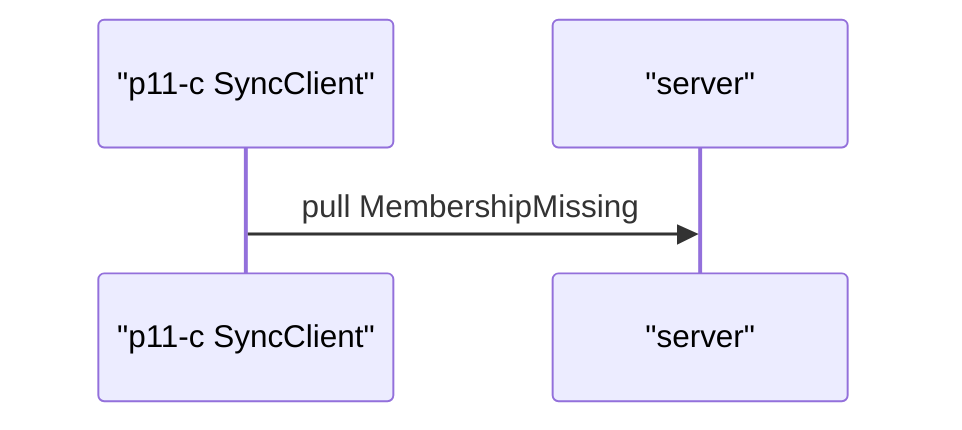

**lease.** B is not a member of `acme`. Its lease on an `acme` execution is rejected with `MembershipMissing`. A, a member, takes the same lease and the server acks. The server holds only A's lease. [lease](../../tools/qualification/src/probes/p11-checks.ts#L171) · [SyncClient](../../libs/sync/client/src/client.ts) · [server](../../libs/sync/server/src/server.ts)

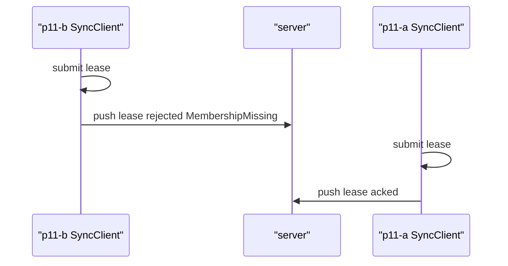

**actor.** A sends a changeset whose envelope names B's person, then one that names `server`. Both get `ActorMismatch`. The same changeset naming A's own person is acked. [actor](../../tools/qualification/src/probes/p11-checks.ts#L210) · [SyncClient](../../libs/sync/client/src/client.ts) · [server](../../libs/sync/server/src/server.ts)

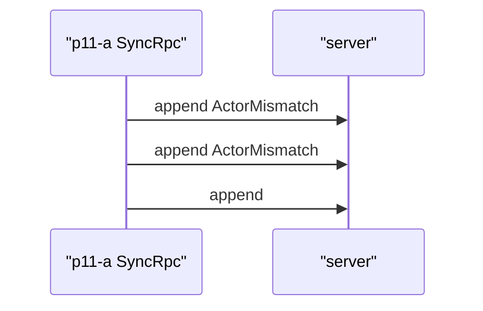

**server-only attributes.** A tries to grant B membership of `acme` by writing the membership datom itself. The server answers `ServerOnlyAttribute`, and B's person is still not a member. [serverOnlyAttributes](../../tools/qualification/src/probes/p11-checks.ts#L252) · [SyncClient](../../libs/sync/client/src/client.ts) · [server](../../libs/sync/server/src/server.ts)

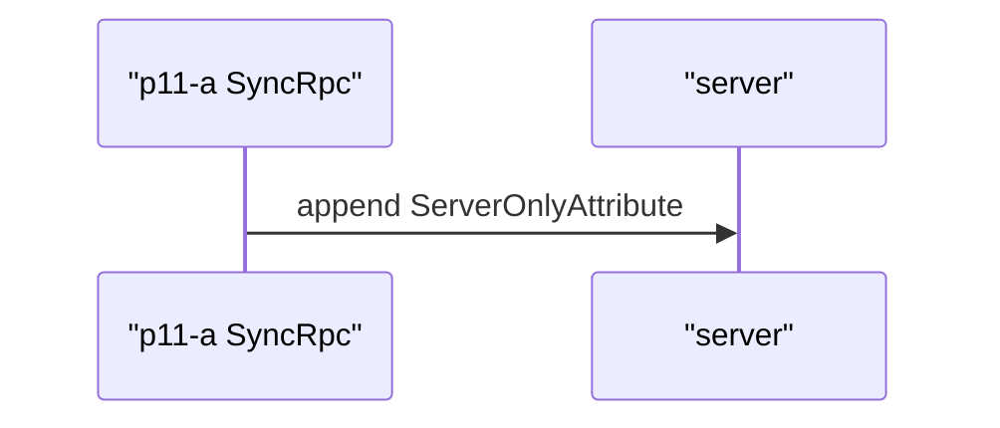

**server-only root.** A's `pull` of `acme` holds its own membership and no account datom, so no provider subject reaches a device. A changeset that writes an account entity gets `ServerOnlyAttribute`. [serverOnlyRoot](../../tools/qualification/src/probes/p11-checks.ts#L278) · [SyncClient](../../libs/sync/client/src/client.ts) · [server](../../libs/sync/server/src/server.ts)

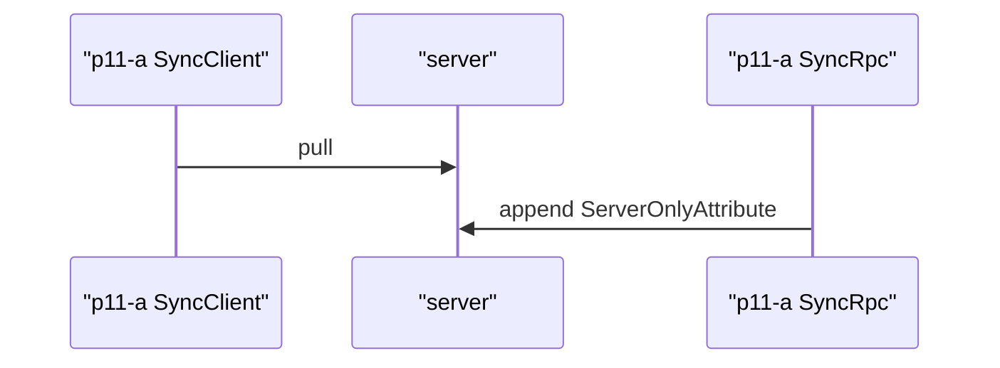

**revocation.** A has an unsent title when the operator revokes its membership; its token is still valid. The next `push` rejects the row with `MembershipMissing` and keeps it in the outbox. A new local change is refused. After a new grant, a `pull` succeeds and A can change `acme` again. [revocation](../../tools/qualification/src/probes/p11-checks.ts#L313) · [SyncClient](../../libs/sync/client/src/client.ts) · [server](../../libs/sync/server/src/server.ts)

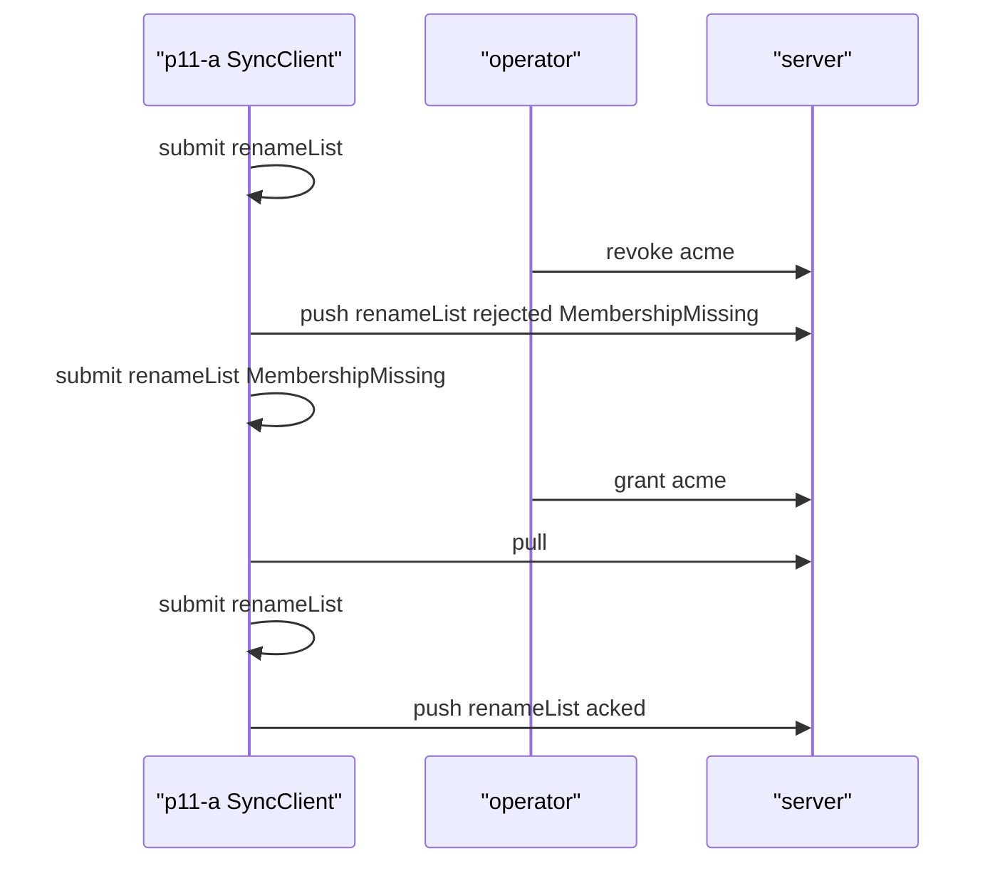

**acceptance time.** A submits a changeset that claims the server already accepted it at `5`. The outbox and A's log hold no acceptance time. The server stamps its own clock when it acks, and after the push A's log holds the server's value. [acceptanceTime](../../tools/qualification/src/probes/p11-checks.ts#L348) · [SyncClient](../../libs/sync/client/src/client.ts) · [server](../../libs/sync/server/src/server.ts)

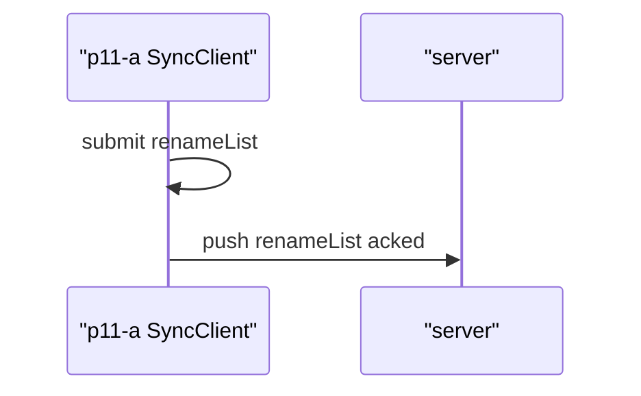

**blobs per organization.** A uploads a file to `acme`. B names the same hash in a changeset for `other`: the server answers `FileMissing`, because `acme`'s copy is not `other`'s. After B uploads the file to `other`, the same changeset is acked. A cannot upload to `other`. [blobsPerOrganization](../../tools/qualification/src/probes/p11-checks.ts#L382) · [SyncClient](../../libs/sync/client/src/client.ts) · [server](../../libs/sync/server/src/server.ts)

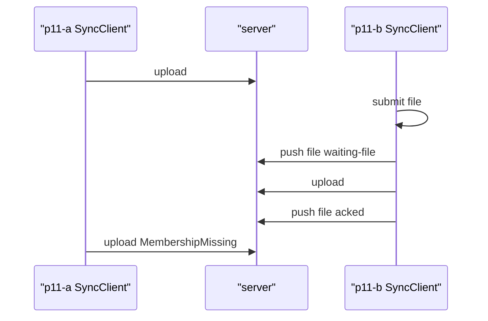

**missing token.** D sends no token and E sends a string that is not a token, both as members of `acme`. Each call is refused with `TokenRejected` before any handler runs: `missing` for D, `invalid` for E. [missingToken](../../tools/qualification/src/probes/p11-checks.ts#L443) · [SyncClient](../../libs/sync/client/src/client.ts) · [server](../../libs/sync/server/src/server.ts)

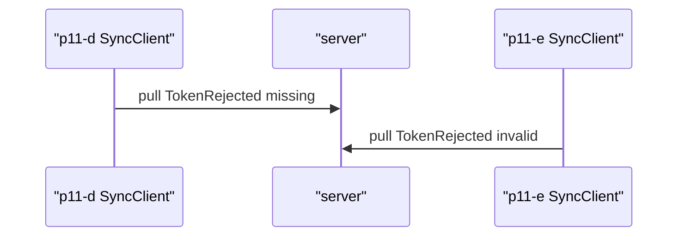

**sign-in needed keeps outbox.** F's session can no longer refresh. A local change still goes into the outbox. `push` fails with `SignInNeeded` and the row stays `pending`, so nothing is lost until F signs in again. [signInNeeded](../../tools/qualification/src/probes/p11-checks.ts#L479) · [SyncClient](../../libs/sync/client/src/client.ts)

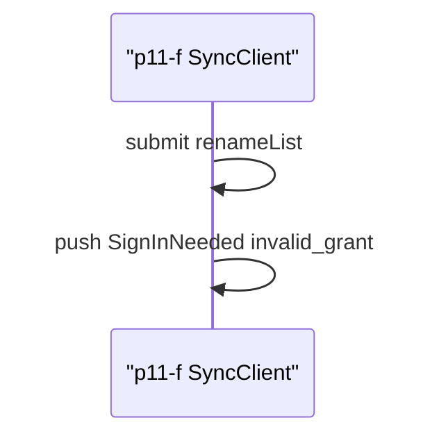

**caller statement.** `Caller` is the server's statement a device labels its writes with (Q22). For A it names A's person and `acme`. After a grant in `other` it names both; after `acme` is revoked, only `other`. C, never granted, gets no person and no organizations. [callerStatement](../../tools/qualification/src/probes/p11-checks.ts#L513) · [SyncClient](../../libs/sync/client/src/client.ts) · [server](../../libs/sync/server/src/server.ts)

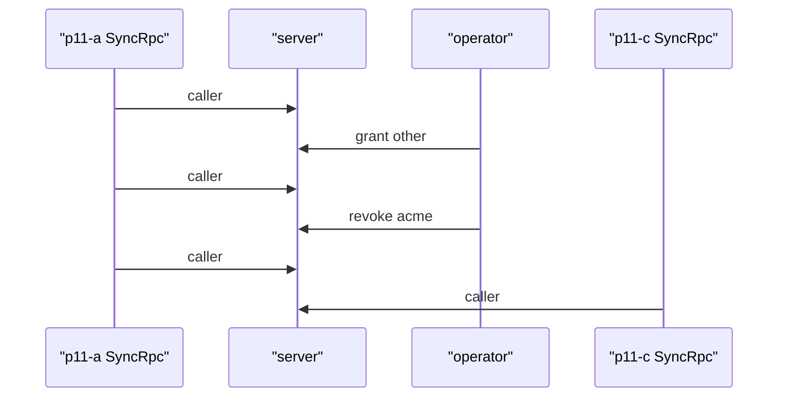

**Outbox.** The transitions recorded on `SyncClient.outbox` spans. [SyncClient](../../libs/sync/client/src/client.ts)

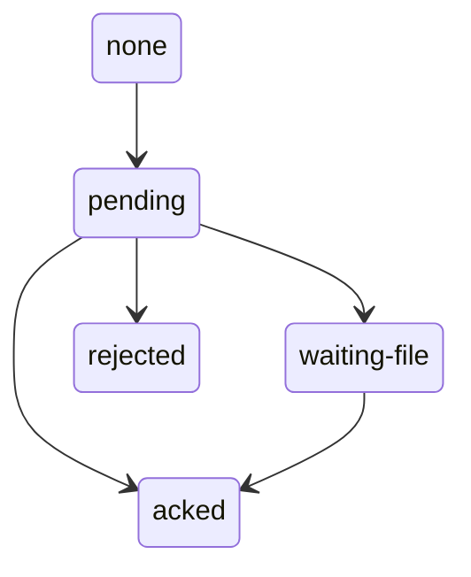
<!-- span-review:end -->

## Findings on the way

Found during steps 2-6 and fixed there; details in the [design review](p11-design-review.md):

- The HLC ordering bug the HTTP round trip exposed (whole milliseconds), fixed in `21b34d7e1` ([ADR-0007](../adr/0007-hybrid-logical-clock.md)).
- Keycloak omits `aud` without an audience mapper; imported users lack the realm's default roles, so `offline_access` was missing until the realm file named them.
- Metro's `Cross-Origin-Opener-Policy` severed the web sign-in popup; it is no longer sent. P02, P04 and P05 web re-run in step 8.
- `@effect/sql-sqlite-wasm` waited forever when the OPFS worker failed before it was ready; `@viviefs/store-sqlite-wasm` now bounds the open, checks the 64-character path limit and raises the worker's failure.
- The iOS simulator can leave WebKit's GPU process hanging in the sign-in sheet after long use, so the device run reboots it; Chrome on the emulator switches web accessibility off after a quiet spell, so the lab forces it on.

Found in step 7:

- The span review needed to show why a push was refused and which organization a membership change touched. `SyncClient.outbox` spans now carry `outbox.rejection` for a rejected row, and `Memberships.grant` / `Memberships.revoke` spans carry `membership.org`. The probe's own RPC calls are traced per device by the shared [`sync-world.ts`](../../tools/qualification/src/probes/sync-world.ts), so P09's check no longer wraps its call itself; P09's span review is unchanged apart from line anchors.

## Not measured here

- Physical devices. P11 ran on the iOS simulator and the Android emulator.
- TLS and production web sessions: the lab is plain HTTP, and web tokens live in memory only (decided with production hosting).
- `EngineConfig.actor` from the server's statement: the P11 screen writes through `SyncClient` and does not run the workflow engine (design review section 9).
- Roles in use, invitations, self-service membership, and local deletion after revocation (P13).
- Tamper-evidence of stored history, device identity (`envelope.device` is not authenticated) and who may take a lease: the identity, keys and trust step (Q15, Q23, Q24).
- The trace projector on devices (Q13).
