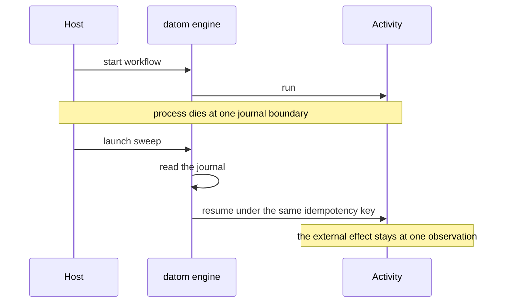
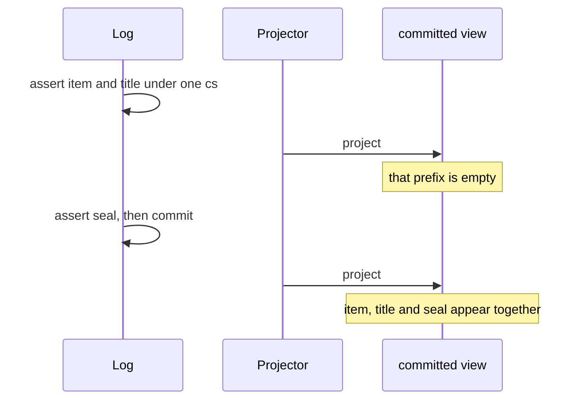

# P01-P07 review

One sitting. Each gate claims a fact. This page puts that claim next to what the recorded run did, and names the pattern we would copy. The 2026-09-22 review filled the calls below.

This page does not pass a gate and does not edit the ledger. Qualifying ADR-0003 and ADR-0004 links the existing P01 ledger pass. It does not move any ADR to Accepted. A ledger pass stays historical: later commits make its fingerprint stale. Foundation closure is still one sequential P01-P10 run on an unchanged tree.

| Gate | Claim | What the run did | Where to look |
| --- | --- | --- | --- |
| P01 | Effect v4 on SDK 58 / Hermes, both devices, polyfill control, SQL bundle, iOS 27 meaning, bundle baseline | All of that is in the 2026-09-20 artifacts. The 2026-09-22 review wrote the evidence note and marked ADR-0003 and ADR-0004 Qualified. | [2026-09-20-p01.md](2026-09-20-p01.md) |
| P07 | Force-quit mid-upload and mid-wait, relaunch resumes, a notification tap completes a deferred | Journal resume and motel park/resume spans happened on iOS and Android. The kill was `simctl terminate` / `adb force-stop`. The deferred was completed from JavaScript when the banner was not hittable. | [2026-09-21-p07.md](2026-09-21-p07.md) |
| P06 | Kill at every journal boundary resumes, and each external effect is observed at most once. The memory engine fails those durability cases. | Seven boundaries passed on sqlite-node and PGlite. The memory engine failed durability, which is the control. The upload hash is computed outside the activity. `engine.ts` was 646 lines on that run. | [2026-09-20-p06.md](2026-09-20-p06.md) |
| P05 | A changeset is invisible until it is complete, then every member appears together | Fourteen checks passed on node, PGlite, iOS, Android, and web. Attribute names are pinned. Conflict rows sit in `projection_conflicts`, not in the log. | [2026-09-20-p05.md](2026-09-20-p05.md) |
| P02 | Official SQLite drivers on iOS, Android, and web. D16 named op-sqlite 17.x. | Same six checks passed, including the expo-sqlite fallback. The pin is `@op-engineering/op-sqlite@18.2.5` because 17.x does not compile. ADR-0005 records that amendment. | [2026-09-20-p02.md](2026-09-20-p02.md) |
| P03 | A known span reaches motel from a simulator. The physical-device path is documented. | iOS and Android simulators delivered the span. A wrong endpoint on iOS produced no motel row and no crash. A physical phone was not run. | [2026-09-20-p03.md](2026-09-20-p03.md) |
| P04 | Append, dedup, HLC, cursors, prefix scans, compaction, on SQLite and Postgres | Eleven checks passed on node, PGlite, iOS, Android, and web. The picks are 5000 ms future skew and 2000 datoms. Postgres in the probe is PGlite. | [2026-09-20-p04.md](2026-09-20-p04.md) |

## P01

The probe did the gate's work. With `expo-crypto` on `globalThis.crypto`, 15 checks passed on the iOS simulator and the Android emulator. Without it, `workflow memory` failed on both, which is the positive control. The SQL export built (3653396 bytes). The baseline bundle was 3389852 bytes. "iOS 27" was recorded as the build SDK: the run used Xcode 26.6 and an iOS 26.5 simulator.

The gap was the human record. [2026-09-20-p01.md](2026-09-20-p01.md) points at that run. The 2026-09-22 review filled ADR-0003 and ADR-0004 Observed and marked both Qualified. Neither is Accepted.

Call: amend. Qualify ADR-0003 and ADR-0004 from the existing pass. Do not re-run.

## P07

The journal fact holds on the recorded run. Force-quit mid-upload and mid-wait, then relaunch with `EngineSweep`, resumed `DeviceResume.v1` on both devices. Skipping the sweep left the workflow parked. Motel received `p07.park` and `p07.resume` for the mid-upload token.

Two steps in the gate text were done another way:

- The kill was `simctl terminate` on iOS and `adb force-stop` on Android. `agent-device replay --maestro` did not own the quit (iOS `SESSION_NOT_FOUND`; Android Expo developer menu covered the probe UI).
- The scheduled notification title was not hittable. After relaunch the approval deferred was completed from `lastNotificationData`, or from `runtime:eval` of `globalThis.__viviefsP07Complete()`.

What we would copy: launch calls `EngineSweep` explicitly. The engine does not sweep itself. A visible notification tap stays deferred.

Call: keep. Resume after a real process kill is the qualified fact. Do not re-run for the banner.

## P06

One workflow, killed at one boundary, then asked to resume.

The same kill on `WorkflowEngine.layerMemory` has no journal. The activity runs again. That failure is the positive control.

The seven boundaries, each its own run: before an activity, during it, after it and before the journal write, during a deferred wait, during a clock, during a lease handoff, during a content-hash upload.

The upload check does not call `crypto.subtle.digest` inside the activity. P01 showed that digest works on Hermes with the polyfill. P06 records that `Effect.tryPromise` around that digest does not complete inside an activity fiber, so the harness hashes `p06-file` first and the activity journals `blob:{sha256}`. ADR-0012 Observed records that constraint.

Call: amend. Keep the crash matrix. Record the outside-the-activity hash on ADR-0012. Do not re-run.

## P05

A changeset is one visibility boundary. Members can sit in the log while the committed view still has none of them. The commit makes every member appear together. This is the incomplete-changeset check: `item`, `item/title`, and `item/seal` under one `cs`.

Abort, expiry, and a failed basis check are the other ways a changeset stays out of that view. Basis policies on this gate are LWW, write-once, and human conflict. Human-conflict rows are stored in `projection_conflicts`. They are not datoms yet. P09 may append conflict datoms at accept time.

A full rebuild from the log equals the incremental snapshot. Reactivity keys are `prefix:{id}` and `attribute:{name}`.

The names in `libs/datom/src/vocabulary.ts` are frozen (D44).

Call: keep. Atomic visibility and the pinned names stay. Conflict rows stay out of the log until P09.

## P02

Six checks on every driver: migrate, transaction commit, transaction rollback, eavt by entity, eavt by attribute, index volume of 1500 rows. iOS, Android, and web passed for the official driver and for the expo-sqlite fallback.

The pattern we would copy is `@effect/sql-sqlite-react-native` on `@op-engineering/op-sqlite@18.2.5`, and `@effect/sql-sqlite-wasm` with OPFS on web. expo-sqlite stays a retained probe. D16 named 17.x. ADR-0005 already amends that to 18.2.5, because 17.x does not compile on RN 0.88 (`RCTCxxBridge` removed). Effect's peer range is still `<18`, so the workspace override is part of the pin.

Call: keep.

## P03

The app emitted `p03.known-span` with a unique `probe.token`. Motel search found it from the iOS simulator and from the Android emulator (`adb reverse` on port 27686). A wrong endpoint on iOS left no motel row and did not crash. The Android wrong-endpoint case was not run.

[p03-physical-device.md](p03-physical-device.md) is the physical path: bind motel on the LAN, or catch up later from the log cursor (that catch-up is P10). The gate asks for the path to be documented. A phone was not in this run.

motel itself runs on Effect `4.0.0-beta.90` inside `vendor/motel`. The app stays on the workspace RC. That split is a packaging pin.

Call: keep. A phone run and an Android wrong-endpoint control are not required to leave this gate as recorded.

## P04

Eleven checks, including duplicate append as a no-op while a new `tx` is appended: append, duplicate append, HLC mint, backwards clock, reboot, remote-ahead, future skew, cursor streaming, prefix scans, compaction horizon, volume. sqlite-node, PGlite, iOS, Android, and web passed.

The pattern we would copy is one datom log: `datoms(e, a, v, tx, op, cs)` plus `seq`, `changesets`, `hlc_state`, `device_cursors`. Attribute names stay unpinned here. P05 pins them.

Two numbers are the human picks: future skew `5000` ms, append volume `2000` datoms. The Postgres dialect in the probe is `@effect/sql-pglite`, not a Postgres server.

Call: keep. Those picks and PGlite stay the recorded probe.
