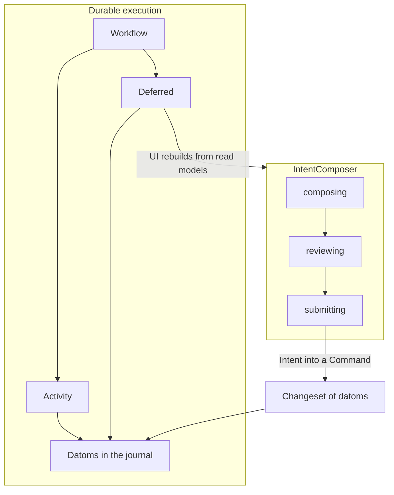
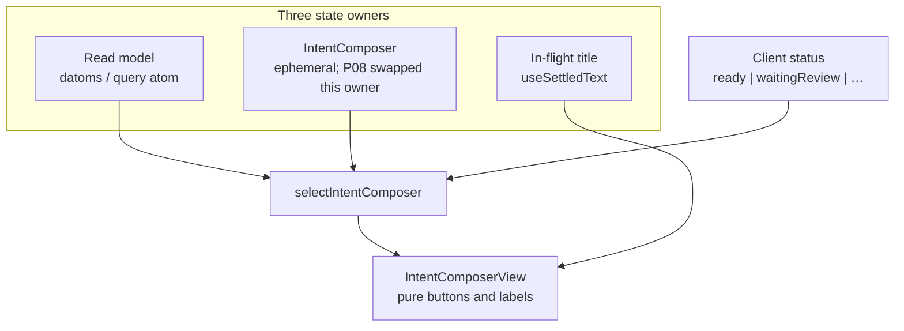
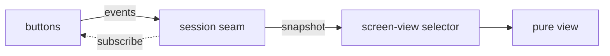
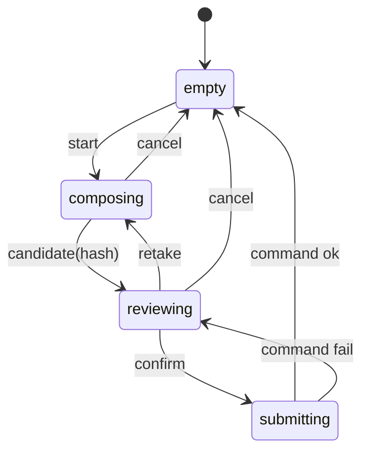
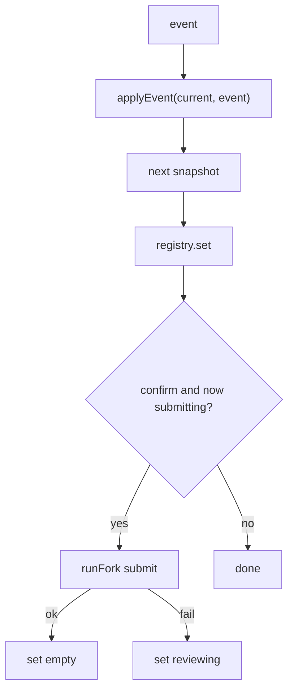
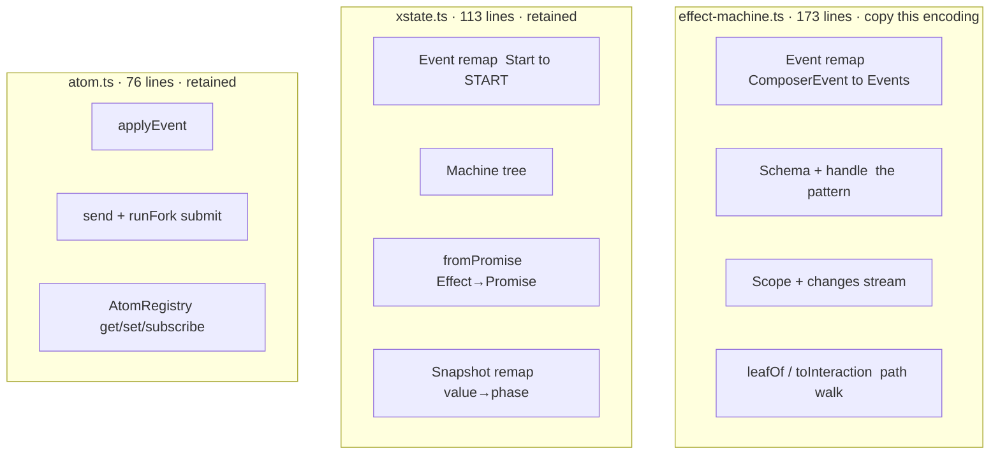
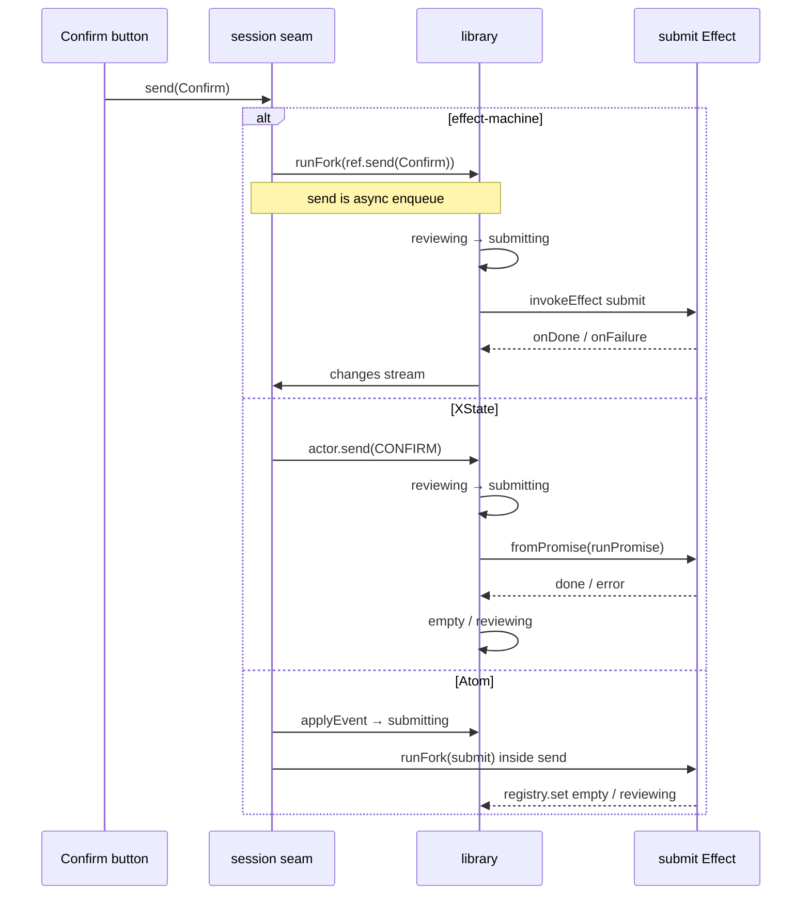

# P08 comparison: one machine, three encodings

This page is the **human review** of the three P08 probes. It is not a new
qualification claim. The ledger still records that all three passed the same
tests. ADR-0020 stays **Qualified**; the conclusions below are what future
screens copy.

P08's probe winner was Atom (file LOC + sharing query atoms). Review of the
encodings, with durability, typing, and a checkable graph as first-class
criteria, picks **effect-machine**.

**Conclusions**

- Pattern name: **IntentComposer**. Parts: **composing | reviewing |
  submitting**. Exemplar: `features/evidence/client/src/intent-composer/`.
- Implementation to copy: **`@typeonce/effect-machine`**. XState and Atom
  stay retained probes behind the session seam.
- Generated **mermaid** from the machine is part of the pattern (docs and
  teaching). A later choice may generate **XState JSON** for Stately viz
  instead of mermaid; the seam keeps that option open.
- **No telemetry** on IntentComposer. Only the durable command / workflow
  is traced (motel / log-derived spans). Understanding this pattern is the
  teaching graph, not live `withSpan` on states. Screen/status inspection
  belongs in a **devTool** next to rendering, not in OTLP.
- Durability stays on workflows and datoms. This graph is not a
  **transaction**.

Source files live in `features/evidence/client/src/intent-composer/`.

## 1. Durability is a different pattern

Durable execution is a **workflow** whose body re-runs and replays **activity**
results stored as **datoms** in the **journal** (D11, ADR-0015, ADR-0012). A
killed app resumes at a **deferred**, not at "half a screen".

IntentComposer is the other owner: **ephemeral interaction**. Kill the app
and composing / reviewing start over from the **read model**. Nothing in
this machine is stored as a datom. Persisting the actor, checkpointing the
phase, or resuming mid-review would be the wrong pattern.

The composer is allowed to vanish. The workflow is not. That split is an
explicit part of this comparison so a later screen cannot quietly fold
IntentComposer into the engine.

## 2. Not a transaction

A **datom** is its own transaction. A **changeset** is atomic visibility of
several datoms. A **command** is `(readModel, intent) -> changeset or
DomainError`. An **intent** is the user's requested change, input to a
command. Not a datom. ([CONTEXT.md](../../CONTEXT.md))

IntentComposer holds a *candidate* until submitting produces an intent for a
command. Cancel drops the candidate. A kill drops the candidate. There is no
half-written datom and nothing to roll back, because there was no
transaction in this graph.

Call a datom's unit a transaction. Do not call composing, reviewing, or
submitting a transaction. Submitting is the seam *toward* a command. Until
then it is composition and review of an intent that does not exist yet.

## 3. IntentComposer vs P08 probe names

The pattern name is IntentComposer. The exemplar uses those names
(`empty`, `composing`, `reviewing`, `submitting`, `candidateHash`).

| Pattern | Exemplar | Role |
| --- | --- | --- |
| IntentComposer | IntentComposerScreen / ComposerSession | Ephemeral composer of an intent |
| empty | `empty` | No candidate, not assembling |
| composing | `composing` | Assembling the candidate (camera, file, …) |
| reviewing | `reviewing` | Looking at the candidate before it is an intent |
| submitting | `submitting` | Handing the intent to a command |
| candidate hash | `candidateHash` | See section 4 |

`Capture` reads as "the camera" or the durable evidence item. The graph is
compose → review → submit an **intent**. Waiting-for-review after a
successful submit is **status** on the read model (a deferred in the
workflow), not a part of this composer.

## 4. What `candidateHash` is

`candidateHash` is the **candidate blob** content-hash held only while
**reviewing** or **submitting**. It is not:

- a **blob** already referenced by a datom (`evidence/file` on the read
  model)
- an intent (no command has been called)
- durable (a kill forgets it)

It exists so reviewing can show the photo (or file) you might submit, retake
can throw it away, cancel can throw it away, and a failed submit can return
you to the same candidate instead of a blank composer.

That is why it is **context on two phases**, not a phase of its own, and why
effect-machine (and XState) refuse to carry it on empty/composing: a hash
with no review surface is an illegal snapshot. Atom's record always has
`candidateHash: string | null`, so `{ phase: 'empty', candidateHash: 'blob:x' }`
is representable. That is the typing issue in miniature.

## 5. Shared: three owners, one view, one seam

The screen does not pick a library. It talks to a session seam
(`snapshot` / `send` / `subscribe`). Domain facts, IntentComposer, and
in-flight text stay separate (D41). Waiting-for-review is **status**, not a
phase.

The three driver files (`xstate.ts`, `effect-machine.ts`, `atom.ts`) only
implement **IntentComposer**, the middle owner in that diagram. The selector
and the pure view stay the same for every encoding.

## 6. Shared: the interaction itself

Every variant implements this graph. Candidate hash is context, not a phase.
Labels are IntentComposer names.

| From | Event | To | Candidate hash |
| --- | --- | --- | --- |
| empty | start | composing | none |
| composing | candidate(hash) | reviewing | event hash |
| composing | cancel | empty | none |
| reviewing | retake | composing | none |
| reviewing | cancel | empty | none |
| reviewing | confirm | submitting | keep |
| submitting | command ok | empty | none |
| submitting | command fail | reviewing | keep |

Illegal examples the graph forbids: confirm from empty, candidate-hash from
reviewing, start from composing, a hash on empty.

## 7. Generated mermaid is part of the pattern

A hand-drawn mermaid (this page) is a **cache**. It can drift from the
driver. **Visibility of the legal moves is part of IntentComposer**: concept
page, lesson, and exemplar show one graph that is generated from the
machine and checked in `verify`. If the machine changes and the diagram
does not, verify fails.

**Now:** [`intent-composer.mmd`](../../features/evidence/client/src/intent-composer/intent-composer.mmd)
is generated from [`graph.ts`](../../features/evidence/client/src/intent-composer/graph.ts)
(`intentComposerGraph`). The effect-machine `handle` reads every target from
that same object. A unit test asserts the generator output equals the
committed file, so `verify` fails when they drift.

**Later, optional:** generate **XState JSON** (machine definition / diagram
data) instead of mermaid, and teach with Stately viz. research/05 notes
`@xstate/effect` and that effect-machine and XState are learning toward a
shared implementation. The session seam is what lets the viz backend move
without rewriting screens. Do not bind teaching to mermaid-the-file-format
forever; bind it to "the graph is generated from the machine and verified".

Atom has no graph to render. That is a reason it is not the encoding we
copy.

Follow-up for teach (bootstrap step 7): the concept page and lesson cite
this generated file. Do not hand-draw a second copy.

## 8. How each encoding writes that graph

Read these three blocks as the **encoding**, not the whole file. Wrappers are
in section 9.

### effect-machine: the encoding we copy

Same shape as the graph in section 6, with typed state fields
(`candidateHash` only exists on reviewing/submitting) and `invoke` that keeps
`submit` as an Effect. `onFailure` can carry the hash back without a
Promise seam. Schema + `handle` are what the mermaid generator reads.

The cost: starting the machine needs a live `Scope`. `send` enqueues
(`runFork`); tests must wait. Mapping library snapshots onto the P08
tagged union is a path walk (`leafOf` / `toInteraction`). Pre-1.0,
single-maintainer; the session seam is the mitigation.

File: [`effect-machine.ts`](../../features/evidence/client/src/intent-composer/effect-machine.ts)

### XState: retained probe

States list the events they accept. An illegal event is a no-op because it
is not in that state's `on`. Submit is an invoked actor. The tree is
documentation, and XState already has viz (the future JSON-diagram option).

The cost: Effect becomes a `Promise` at `fromPromise` (`Effect.runPromise`).
Errors are untyped at the machine boundary. Events and snapshots are
remapped.

File: [`xstate.ts`](../../features/evidence/client/src/intent-composer/xstate.ts)

### Atom: retained probe

There is no state tree. One record is always fully shaped (`phase` + `candidateHash`). Illegal transitions return `current` unchanged. Submit is
not in the reducer: `send` sets submitting, then `runFork`s the Effect.

The cost: `{ phase: 'empty', candidateHash: 'blob:x' }` is representable. An
LLM can construct it and the typechecker will not object. There is nothing
to generate a diagram from. Query atoms can stay Atom; IntentComposer does
not have to.

File: [`atom.ts`](../../features/evidence/client/src/intent-composer/atom.ts)

## 9. Adapter tax: what the LOC number actually counted

P08 counted non-comment lines in the whole driver file. That mixes **the
pattern you would copy** with **glue to the P08 session seam**.

Atom is smallest because the P08 tagged union *is* its model. effect-machine
looks large because of snapshot mapping. Future screens should use
effect-machine's Schema/`handle` as the copy target, not the P08 path-walk
wrapper. LOC on this 4-state screen is not why we pick it.

## 10. One click: Confirm

Shared path in the UI: button → `session.send(Confirm)` → selector reads
`submitting` then empty or reviewing.

effect-machine and XState: the invoked effect is **in the graph**.
Atom: the invoked effect is **in the session wrapper**. After success, a
**command** may mint a **changeset**. That write is durable. The composer
is already empty.

## 11. Typing is why effect-machine wins for generated code

For an AI-robust stack (ADR-0025) unrepresentable illegal states are
required, not a tie-breaker after LOC.

- effect-machine: impossible phases are missing from the tree.
  `candidateHash` is not a field on empty/composing. Submit failures stay
  typed Effect errors. An LLM that emits a hash on empty fails the
  typechecker.
- XState: same tree, but `fromPromise` erases Effect errors.
- Atom: one record type for every phase. Generated code that constructs a
  bad snapshot still compiles.

LLM-maintained screens accrue those illegal snapshots. The typechecker is
the local, cheap guard. Combined with a generated mermaid that verify
checks, effect-machine is the encoding future screens copy.

## 12. Telemetry: none on IntentComposer

Durable understanding stays as specified: traces are **derived from the
log** (ADR-0018, P03, P10). Envelope `traceId` / `spanId` on a changeset;
projector emits deterministic spans; live `withSpan` inside **activities**
is parented to those durable spans.

**Choice: no telemetry on IntentComposer.** Only the durable command /
workflow is traced. motel is not how you debug composing vs reviewing.

Live `withSpan` on composer states is the wrong tool: those spans die on
kill, they are not the journal, and they sit too far from what a person
actually sees. Ephemeral UI inspection belongs in a **devTool** next to
**screen-view** and **status** rendering (the selector output), not in
OTLP.

**Understanding this pattern** is the generated teaching graph (section 7).
**Understanding durability** is motel / the log-derived trace.

## 13. What P08 measured, and what review concluded

| Question | P08 probe | Review (this page) |
| --- | --- | --- |
| Can all three pass the same tests? | Yes | The seam works |
| Can a variant fail those tests? | Yes (`broken.ts`) | The bar is real |
| Fewest driver-file lines? | Atom 76 | Not the pick criterion |
| Share a library with query atoms? | Atom | Query atoms stay Atom; IntentComposer does not |
| Typed Effect errors on submit? | effect-machine | Required |
| Illegal phases unrepresentable? | XState and effect-machine | Required for LLM-maintained code |
| Graph generated from code? | Neither in the probe | **effect-machine mermaid**, now part of the pattern; XState JSON later optional |
| Durable execution? | No | Workflows + datoms. Keep the split |
| A transaction? | No | Intent → command → changeset |
| Composer OTLP? | Not measured | **None.** Teaching graph + durable traces. UI inspection is a devTool |
| Name? | IntentComposer | composing, reviewing, submitting, `candidateHash` |
| Encoding to copy? | Probe said Atom | **effect-machine** |

Product voice and affordance stay out (D55).

## 14. What we copy

**IntentComposer** in **effect-machine**, with a **generated mermaid**
checked in verify. Session seam so XState JSON viz can replace mermaid
later without rewriting screens. Query atoms remain Atom (D42). No
composer telemetry.

effect-machine is pre-1.0 and single-maintainer; the seam is the
mitigation, including a future shared implementation with XState.

## 15. Ten-minute read of the code

1. This page, sections 1 to 4 and 7, 11, 12 (conclusions).
2. [`screen-view.ts`](../../features/evidence/client/src/intent-composer/screen-view.ts)
   and [`IntentComposerView.tsx`](../../features/evidence/client/src/intent-composer/IntentComposerView.tsx)
   — what the user sees; no library.
3. The graph in section 6, then the `handle` region of
   [`effect-machine.ts`](../../features/evidence/client/src/intent-composer/effect-machine.ts).
   Checked diagram: [`intent-composer.mmd`](../../features/evidence/client/src/intent-composer/intent-composer.mmd).
4. [`checks.ts`](../../features/evidence/client/src/intent-composer/checks.ts) — the
   shared bar. [`broken.ts`](../../features/evidence/client/src/intent-composer/broken.ts)
   — Confirm omitted on purpose.
5. [`IntentComposerScreen.tsx`](../../features/evidence/client/src/intent-composer/IntentComposerScreen.tsx)
   — wiring. It never imports a library; the driver is injected.
6. [`query-atom.ts`](../../features/evidence/client/src/intent-composer/query-atom.ts)
   — D42. Independent of IntentComposer.

Gate record: [2026-09-21-p08.md](2026-09-21-p08.md). Decision record:
[ADR-0020](../adr/0020-interaction-state-three-way-prototype.md).
