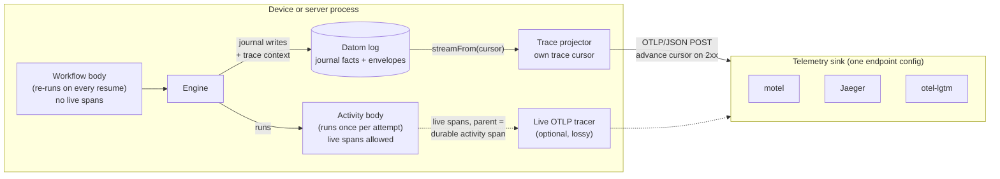
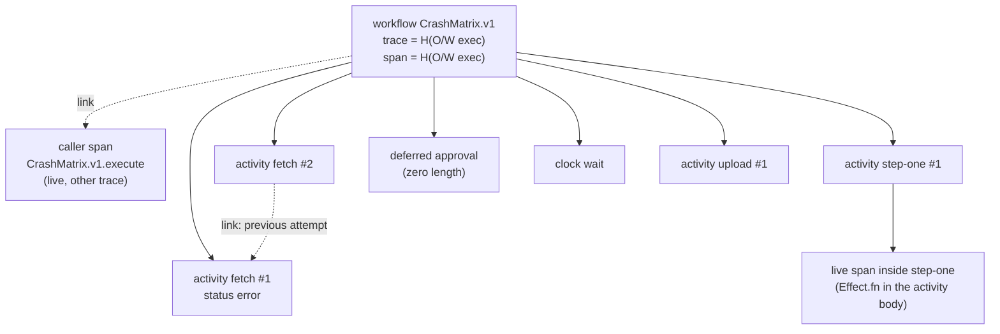
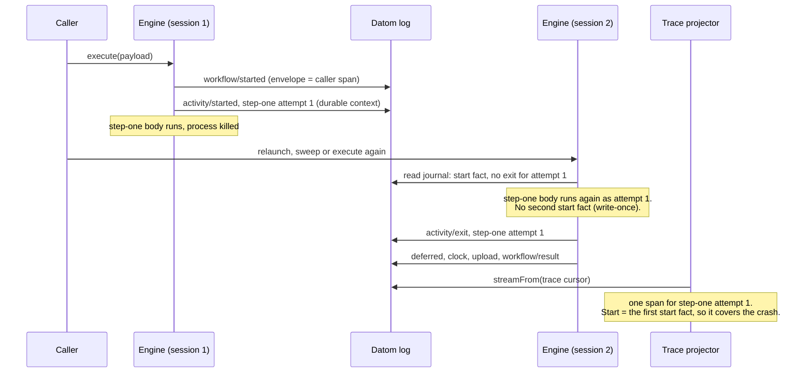
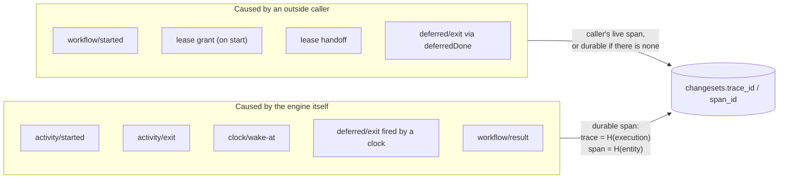
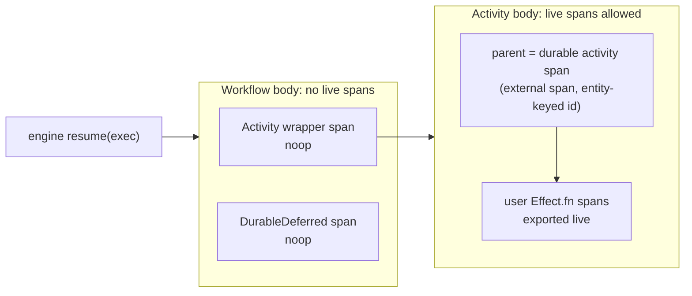
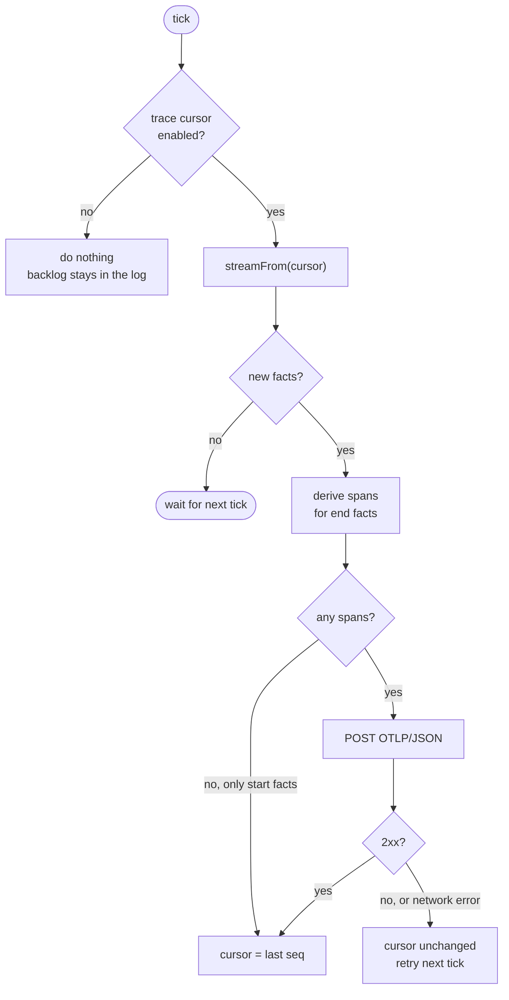
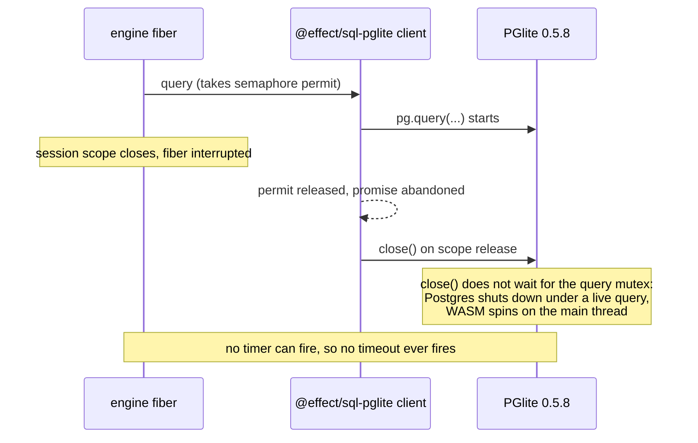
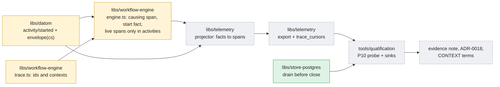

# P10 design review: trace projection

Review before the gate runs. This page does not pass P10 and does not edit the ledger. It shows what P10 claims, how the design meets each part of the claim, what is already changed in the tree, what is still to build, and the choices that need a yes or no from you.

> **P10 has not run.** The ledger has no P10 entry and `p10.ts` is still the stub that refuses to run. The design below was reviewed on 2026-09-26: choices A-G (section 12) and the pattern names (section 10) are agreed. The engine half was drafted before that review, then finished and tested as step 1 of the plan.

| Part | State on 2026-09-26 |
| --- | --- |
| Design (this page) | reviewed, agreed |
| Engine writes causing spans and an activity start fact | done: five engine checks pass on sqlite-node and PGlite, each shown to fail on a broken journal |
| `LogStore.envelope(cs)` read | done: P04 `append` round-trips it on every store |
| PGlite close drains queries (found while re-running P06) | committed `a7857e4fb` |
| Trace projector, OTLP export, trace cursor | not written |
| P10 probe, three sink smoke tests, evidence note | not written |
| Gate P10 | not run |

## 1. The claim

From [06-qualification-gates.md](../plan/bootstrap/06-qualification-gates.md):

> **P10 Trace projection.** The trace derived from the log is lossless and stable across replays. A crash-and-resume run produces one trace with deterministic span ids, no duplicate spans on replay, attempts linked; the same smoke test passes against motel, Jaeger and otel-lgtm. Positive control: disabling the trace cursor loses nothing; re-enabling exports the backlog.

Decisions behind it: D32 (trace context in the envelope, spans derived from the log with deterministic ids, durable export from a cursor, live spans in activities parented to durable spans) and D45' (one OTLP endpoint config, three sinks). ADR: [0018](../adr/0018-tracing-and-telemetry-sinks.md).

The claim splits into six checks. Each one can fail on its own.

| # | Check | How it can fail |
| --- | --- | --- |
| 1 | **One trace**: every durable span of an execution has the same trace id, before and after a crash | a resumed run starts a new trace |
| 2 | **Deterministic ids**: projecting the same log twice gives the same span ids | ids come from a random source |
| 3 | **No duplicates on replay**: a killed activity whose body ran twice has one span; a replayed stored result adds none | the body re-run or the replay emits a span |
| 4 | **Attempts linked**: a retried activity has one span per attempt, and attempt 2 links attempt 1 | attempts collapse, or have no link |
| 5 | **Three sinks**: motel, Jaeger and otel-lgtm each return the same span-id set for the trace | a sink drops, renames or rejects spans |
| 6 | **Positive control**: with the trace cursor disabled a sink has nothing; re-enabled, the full backlog arrives | export is not cursor-driven, so a disabled cursor loses data or never catches up |

## 2. The picture

Two paths reach a sink. **Durable spans** come from the log and are the source of the claim. **Live spans** come from Effect's in-process tracer, add detail inside activities, and are best effort: a kill loses them.

Read it as: the journal is written anyway for durability. The projector turns journal facts into spans later, from its own cursor. A kill loses nothing, because nothing about the durable spans lives only in memory.

## 3. From journal facts to spans

Every durable span comes from one journal entity. The span id is a hash of that entity id, and the trace id is a hash of the execution entity id. Any process that can see the entity id gets the same ids: the same device after a relaunch, another device after a lease handoff, or the server.

| Span | Entity (id source) | Start | End | Parent | Links | Emitted when the projector sees |
| --- | --- | --- | --- | --- | --- | --- |
| workflow `CrashMatrix.v1` | `O{org}/W{exec}` | `workflow/started` tx | `workflow/result` tx | none | caller span from the start envelope | `workflow/result` |
| activity `step-one #1` | `O{org}/W{exec}/A{name}#{n}` | `activity/started` tx | `activity/exit` tx | workflow span | attempt `#n-1` | `activity/exit` |
| clock `wait` | `O{org}/W{exec}/C{name}` | `clock/wake-at` tx | the clock's `deferred/exit` tx | workflow span | none | that `deferred/exit` |
| deferred `approval` | `O{org}/W{exec}/D{name}` | same as end | `deferred/exit` tx | workflow span | caller that completed it | `deferred/exit` (not a clock's) |
| lease grant / handoff | `O{org}/W{exec}` | - | - | - | - | events on the workflow span |

Times come from the HLC `pt` of each fact's `tx` (milliseconds, server-corrected).

The resulting tree for one execution:

## 4. Crash and resume, step by step

This is the run check 3 measures. The kill lands inside `step-one`, after its start fact and before its exit.

Why no duplicates: a span exists per journal entity, and journal facts are write-once. How often a body physically ran does not change the number of entities.

## 5. Causing span: which trace context goes in an envelope

Every journal write carries an envelope (D58), and the envelope holds one trace context: a trace id and a span id. Before this change the engine wrote zeros. The rule now:

> **Causing span**: every envelope names the span that caused the write. That is the caller's live span when an outside caller asked for the write, or else the durable span of the fact's entity.

Two kinds of write, with examples:

| Who caused it | Example | Envelope gets |
| --- | --- | --- |
| **An outside caller asked.** Code outside the engine called in, usually inside its own live span. | A screen submits a command that starts a workflow (span `SubmitEvidence`) and the engine writes `workflow/started`. A person taps Approve and the engine writes the `deferred/exit`. Another device takes over the lease. | the caller's live span, so the trace can later say "started by that `SubmitEvidence` command" |
| **Nobody asked at that moment.** The engine does it on its own while it runs the workflow. | recording that an activity started or finished, scheduling or firing a clock, recording the final result | the durable span the fact belongs to, for example the span of `step-one` attempt 1. A deferred exit fired by a clock names the clock's span: the clock caused it, and that exit is the end of the clock span |

If an outside caller has no live span (tracing not installed, or a launch sweep), the envelope falls back to the durable span, so an envelope never holds zeros again.

The trace projector reads the causing span back with `LogStore.envelope(cs)`. When it is a caller's span, the projector turns it into a span link. That is how a command's trace and the execution's trace point at each other without one trace swallowing a multi-day workflow.

## 6. Where live spans are allowed

> **Live span**: a span from Effect's in-process tracer (`Effect.withSpan`, `Effect.fn`), exported when it ends and lost on a kill. Workflow bodies emit no live spans; activity bodies do, under their durable span.

Why the rule: Effect's `Activity` and `DurableDeferred` wrap themselves in live spans with random ids. The workflow body re-runs on every resume, so those spans would repeat in a sink each time. The engine turns live tracing off for the body and back on inside activity bodies, with the durable activity span as parent. An activity body runs once per attempt (twice only when a kill interrupted it), so its live spans describe real work.

Effect on existing probes: P07's `p07.park` for the upload runs inside the `upload` activity, so it is still exported, now as a child of the durable upload span. P09's span review filters on `P09` / `SyncClient` / `SyncAuthority` / `SyncRpc` names and passed unchanged.

## 7. Export and the trace cursor

The projector does its own POST, instead of Effect's batching `OtlpTracer`. That exporter drops its buffer after three failed retries and disables itself for 60 s (research/04 section 3). That is fine for live spans and wrong for a lossless claim.

- One cursor per sink, in a `trace_cursors(sink, seq)` table next to the log.
- Delivery is at least once. A kill between the POST and the cursor write sends the same spans again with the same ids. That is safe to repeat. A sink may store the copy twice, so check 5 compares span-id sets, not row counts.
- Serialization and HTTP stay Effect-native (`OtlpSerialization.layerJson`, `HttpClient`). No `@opentelemetry/*`.

## 8. How the probe runs

Host only, like P06 and P09: sqlite-node log, engine, projector in Node. P03 already showed Effect's OTLP export from Hermes on iOS and Android. The projector is `platform:universal` code, but P10 does not run it on a device.

| Sink | How it runs | Pin | Query for check 5 | Licence |
| --- | --- | --- | --- | --- |
| motel | `vendor/motel` via bun (as P03) | 0.2.8 | `GET /api/traces/{traceId}/spans` | MIT |
| Jaeger | Apple Container | `jaegertracing/jaeger:2.20.0` by digest `46a88626...` (same as complyj) | `GET /api/traces/{traceId}` | Apache-2.0 |
| otel-lgtm | Apple Container | `grafana/otel-lgtm:0.33.1` by digest `d6c52678...` | Tempo `GET /api/v2/traces/{traceId}` (ids come back base64) | image Apache-2.0; bundles AGPL Grafana, Loki, Tempo |

Measured on 2026-09-24: otel-lgtm starts in about 2 s on Apple Container, and one span posted to its OTLP port was readable from Tempo immediately.

## 9. The PGlite hang found on the way

Re-running P06 after the engine change hung. It hung on the committed tree too, in about half the runs, only on PGlite, only in the `kill during upload` / resume path. A V8 tick profile put 92% of the time in one PGlite WASM function.

Fix, committed separately: the store owns the PGlite instance and runs `SELECT 1` before `close()`, so the close waits behind any in-flight query. After the fix: 12 of 12 PGlite matrix runs and 5 of 5 full P06 runs passed, each in about 7 s. `pnpm qualify` would not have hung forever: the harness SIGKILLs a probe at its `timeoutMs` (10 minutes for P06). It would have failed P06 instead.

## 10. Pattern names (agreed 2026-09-26)

These recur across P04-P10. They go into [`CONTEXT.md`](../../CONTEXT.md), and code comments use the same words.

| Name | Definition | Where it appears |
| --- | --- | --- |
| **Durable span** | A span the trace projector derives from journal facts: from its entity's start fact and end fact. Never from a live tracer. A deferred has no start fact, so its span has zero length. | P10 |
| **Live span** | A span from Effect's in-process tracer, exported when it ends and lost on a kill. Workflow bodies emit none; activity bodies do, under their durable span. | P10 engine |
| **Entity-keyed id** | An id that is a hash of an entity id, so every replica and every replay derives it without coordination. | span and trace ids (P10); Effect's own execution id is the same idea over name and idempotency key |
| **Causing span** | Every envelope names the span that caused the write: the caller's live span, or else the durable span of the fact's entity. | P10 engine writes (section 5) |
| **Acknowledged cursor** | A consumer advances its cursor only after the receiver acknowledged; redelivery is safe because ids are stable. | sync pull (P09), trace export (P10), compaction horizon `device_cursors` (P04) |
| **Drain before close** | An owned resource waits for in-flight work before it is released. | PGlite store (`a7857e4fb`) |
| **Trace projector** | Reads the log from its trace cursor, derives durable spans, and exports them to a telemetry sink. Distinct from the read-model projector. | P10 |
| **Trace cursor** | The log position a trace projector has exported and a sink has acknowledged, one per sink. Distinct from the sync cursor. | P10 |

Considered and dropped: "bracket facts" (overlaps with span; the start fact and end fact are part of the Durable span definition), "envelope origin" (two origins are one rule, Causing span), "live island" (a rule, now stated in the Live span definition).

## 11. Change map

Build order, left to right. Colour is status.

Yellow: changed, not committed. Green: committed. Grey, dashed: planned.

| File | What changed | Why |
| --- | --- | --- |
| `libs/datom/src/vocabulary.ts`, `catalog.ts` | `viviefs/activity/started`, write-once, in the activity type (defining stays `activity/exit`) | a durable span needs a start fact |
| `libs/datom/src/log-store.ts` | `envelope(cs)` | the projector reads caller context; the sync server had its own copy of this SQL |
| `libs/sync/server/src/server.ts` | uses `store.envelope` | one read, not two |
| `libs/testing/src/log-store-conformance.ts` | P04 `append` also round-trips the envelope | the new read runs on every store; the P04 check count is unchanged |
| `libs/workflow-engine/src/trace.ts` | new: `traceIdFor`, `spanIdFor`, `durableContext`, `callerContext` | entity-keyed ids; sync SHA-256 via `@noble/hashes` 2.4.0 (MIT) because `crypto.subtle.digest` does not complete inside an activity fiber (P06) |
| `libs/workflow-engine/src/engine.ts` | causing span per write; `activity/started` before the body; live spans only in activity bodies | sections 5 and 6 |
| `libs/workflow-engine/src/journal.ts` | `encodeActivityStarted` / `decodeActivityStarted` `{name, attempt}` | value codec for the new fact |

Gates to re-run because of these changes: P06 (passes, host), P09 (passes, host), P04 and P05 (store code, before closure), P07 (engine on device, before closure). Foundation closure is still one sequential P01-P10 run on an unchanged tree.

## 12. Choices (agreed 2026-09-26)

All seven were agreed as proposed.

| # | Choice | Agreed | Alternative | Why |
| --- | --- | --- | --- | --- |
| A | Trace per execution | own trace per execution, linked to the caller's span | put the execution inside the caller's trace (parent = caller) | computable from the id alone, even when another device or the server reads the log; a multi-day human wait does not stretch the command's trace. D58's "one command, one trace" still holds for the command itself |
| B | New journal attribute `viviefs/activity/started` | add and pin it at P10 | infer the start from the previous fact | an inferred start is wrong after a crash and for parallel activities; the cost is one more local write per attempt. Once shipped it cannot be renamed (D44) |
| C | Exporter | projector POSTs and owns its cursor | Effect `OtlpTracer` batching | the batching exporter drops spans by design |
| D | Deferred spans | zero length at the completion time | a start from "when the body first waited" | that moment is not journaled; adding a fact for it is more writes with no gate asking for it |
| E | `sampled` flag | recorded, ignored by the projector for now | honour it | sampling for durable spans is a policy, not part of the P10 fact; kept as a named slot in open items |
| F | Where P10 runs | host only (sqlite-node, sinks on the Mac) | also run the projector on iOS / Android | P03 measured OTLP from Hermes; P10's fact is about the log and replay, which is host-measurable |
| G | otel-lgtm licence | use the image as a local lab viewer only, pinned by digest | leave otel-lgtm out | it is not a dependency and is never shipped; D45' names it |
