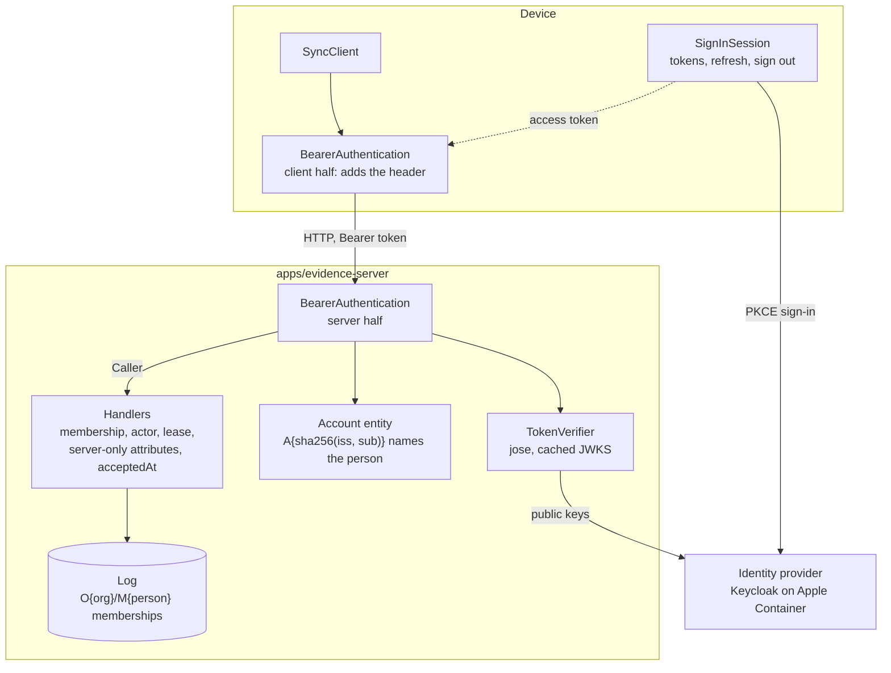

# P11 design review: identity

Review before the gate runs. This page does not pass P11 and does not edit the ledger. It records the P11 grilling (2026-09-27), splits the claim into checks that can each fail, and lists the build steps.

| Part | State on 2026-09-28 |
| --- | --- |
| Grilling (Q1-Q20) | agreed |
| Glossary and ADR-0022 amendment | written |
| `libs/identity`: `TokenVerifier` (OIDC over discovery and JWKS), `Caller`; fake issuer and token contract in `@viviefs/testing/identity` | done (step 2): 9 contract checks pass on the fake and on the OIDC verifier against a served fake; a payload-trusting verifier fails 7 of them; removing the audience check fails exactly `foreign audience` |
| Log (step 3a): `acceptedAt` on the envelope, set once, in every store; identity catalog (account, membership) with server-only attributes; `membershipId`, `accountId` | done: P04 gains check 12 `acceptance time` (sqlite-node and PGlite pass); an existing `changesets` table gains the column |
| Protocol and server (step 3b): `BearerAuthentication` on every sync RPC, `Memberships` (account entity lookup, serialized `grant` / `revoke`), membership, actor and server-only checks, `acceptedAt` stamped, blobs per organization, `CompleteDeferred` RPC; client half with `SignInSession`, revocation handling; the engine writes as the signed-in person | done: P09's nine checks pass on the authenticated protocol with a fake issuer; its sequence diagrams are unchanged |
| P11 Node checks (step 3c): 11 checks in `p11-checks.ts` on a shared `sync-world.ts` (checks 3-9 and 12 above, plus `never granted`, `missing token` and a host-side `sign-in needed keeps outbox`) | done: all pass. Removing the membership check fails 5 of them, removing the actor check fails `actor`, keeping a client's `acceptedAt` fails `acceptance time` |
| HTTP server (step 4): `apps/evidence-server` composes the sync RPCs over HTTP (`/rpc`, NDJSON) on PGlite with an OIDC verifier and a membership seed; `main.ts` reads `VIVIEFS_*` | done: an HTTP round trip against a fake issuer served over HTTP passes (member append and streamed pull with `acceptedAt`; other org, never granted and missing token refused). It found an HLC ordering bug, fixed in `21b34d7e1` (ADR-0007) |
| Keycloak lab (step 5): Keycloak 26.7.3 pinned by digest in `lab-images.json`; realms `viviefs` and `viviefs-other` generated per run with fresh passwords and pinned user ids; one issuer `http://localhost:28080` | done: the token contract passes all 9 checks against Keycloak (`p11-keycloak.ts`). Decoded tokens show each hostile token differs in exactly its claim; Keycloak omits `aud` without the audience mapper |
| `Caller` RPC (step 6, server part): the server's statement about the signed-in provider account (person or none, account, roles, organizations); `SyncRpc.caller` on the device | done: Node check 12 `caller statement` passes and follows grants and revocations; ignoring revocations fails exactly that check |
| Device sign-in (step 6, device part): `oidcSignInSession` in `@viviefs/identity` (PKCE code exchange, refresh, revocation; ports for the prompt, the vault and the server's statement), Expo ports in `@viviefs/platform-native/sign-in`, `syncRpcClientLayer` and `replicaName` in `@viviefs/sync-client`, the P11 screen in the evidence app, the lab in `p11-lab.ts`, and one device scenario for iOS, Android and web in `p11-device.ts` | done: the six device checks (2, the device leg of 3, token storage, 10, 11, removing an account) pass on the iOS simulator, the Android emulator and web against Keycloak and the evidence server. 10 unit tests for the session run on a served fake issuer that now has a token endpoint; a test that lets trace context through fails. Notes in [section 9](#9-step-6-device-notes) |
| Probe (`p11.ts`) and evidence note (step 7) | done: `p11.ts` composes the token contract (fake verifier, OIDC on a served fake, OIDC on Keycloak), the 12 Node checks with a span review in the [evidence note](2026-09-28-p11.md), 4 checks over HTTP with Keycloak's tokens, the six device checks on iOS, Android and web, and three device controls on web (`EXPO_PUBLIC_P11_CONTROL` in the evidence app) that each fail exactly their check. A measurement run passes every section |
| Gate P11 | pass: ledger `2026-09-28T19-38-22.564Z-0f0ac08c` on a clean tree (`971ae6e2`); [evidence note](2026-09-28-p11.md) |
| Sequential P01-P11 run (step 8) | pass: `pnpm qualify --through P11`, run `2026-09-28T22-40-46.395Z-cfafc842` on a clean tree (`59b74a9a`); every gate from P01 to P11 passes in the ledger. Four earlier runs each failed on the lab or the harness, fixed first; [closure note](2026-09-28-p01-p11-closure.md) |

Teaching pages written during the grilling (committed under `.lavish/`; step 7 decides their long-term home):

- [How a request proves who sent it](../../.lavish/p11-q5-token-transport.html) (Q5)
- [Who can tamper with the datom log, and what stops them](../../.lavish/p11-log-tampering.html) (Q14, Q15)

## 1. The claim

From [06-qualification-gates.md](../plan/bootstrap/06-qualification-gates.md):

> **P11 Identity.** Fake and OIDC implementations satisfy one identity contract. Keycloak on Apple Container with PKCE from iOS, Android and web; membership enforced on sync, lease and commands. Positive control: cross-organization access denied while same-organization access allowed.

Decisions behind it: D18 (server-side isolation, never trust a client org id) and D47 (OIDC, Keycloak locally, PKCE on device, a fake for early gates). ADR: [0022](../adr/0022-identity-and-organization-isolation.md).

| # | Check | Where | How it can fail |
| --- | --- | --- | --- |
| 1 | **Token contract**: the fake issuer and Keycloak both pass one suite. A valid token gives a caller. A missing token, changed payload, `alg: none`, a foreign signing key, HS256 algorithm confusion, wrong `iss`, wrong `aud` or an expired token gives `TokenRejected` | Node | a check differs between fake and Keycloak, or a bad token passes |
| 2 | **PKCE sign-in**: a user signs in at Keycloak and the token authenticates a push | iOS simulator, Android emulator, web | redirect, token exchange or issuer differs per platform |
| 3 | **Positive control**: a member of `acme` gets `AppendAck`; the same token asking for `other` gets `MembershipMissing`, on `Append`, `Pull`, `PutBlob` and `CompleteDeferred` | Node, and one device run | a non-member is served, or a member is refused |
| 4 | **Lease**: a non-member's lease datom is refused; the member's lease is accepted | Node | lease fencing ignores membership |
| 5 | **Actor**: an envelope naming another person, or `server`, gives `ActorMismatch` | Node | the envelope's actor is trusted |
| 6 | **Server-only attributes**: a client changeset that writes membership gives `ServerOnlyAttribute` | Node | a member can grant membership |
| 7 | **Revocation**: after `revokeMembership`, the next call with a still-valid token gives `MembershipMissing`; that org's outbox rows become `rejected` and the local copy stays read-only | Node | revocation waits for token expiry |
| 8 | **Acceptance time**: the server stamps `acceptedAt` on accept, `Pull` returns it, and an outbox envelope has none | Node | the device can set it, or it is lost |
| 9 | **Blobs per organization**: the same hash in two orgs is stored independently; `FileMissing` reflects only the caller's org | Node | one org learns whether another holds a file |
| 10 | **Sign-in needed**: a failed refresh keeps the outbox; signing in again resumes sync | iOS, Android, web | work is discarded, or sync loops on a dead session |
| 11 | **Local replica per provider account**: A signs out, B signs in and sees none of A's data or outbox; A signs back in and finds both intact | iOS, Android, web | data or outbox leaks between people on one device |
| 12 | **Server-only root**: after `grantMembership`, a member's `Pull` contains the membership and no account datom; a client changeset that writes an account entity is refused | Node | an account datom (a provider subject) reaches a device, or a client links an account |

Not a gate check, a verify rule: only tests, `tools/` and dev composition may import the fake issuer. It lives in `libs/testing` (`layer:testing`), which no core, adapter or feature project may depend on.

## 2. The picture

## 3. Decisions

Grilling 2026-09-27. Each answer is the agreed recommendation unless noted.

| Q | Question | Decision |
| --- | --- | --- |
| Q1 | Roles in P11 | Membership only is enforced. Roles are carried in the caller and not enforced. Read-side roles and partial sync stay deferred. |
| Q2 | Where membership lives | Datoms in the organization's log, written only by the server and read on every request. The identity provider only authenticates. |
| Q3 | `org` on the wire | Kept as a selector. The server checks membership before using it; failure is `MembershipMissing`. |
| Q4 | Contract and fake | Two services under the identity pattern: `SignInSession` (device) and `TokenVerifier` (server), with one contract suite. The fake issuer signs real JWTs with a local key and goes through the same verification. Only tests, `tools/` and dev composition may import it. |
| Q5 | Transport and token travel | Effect RPC over HTTP (`protocol: 'http'`) in `apps/evidence-server`. RPC middleware reads `authorization: Bearer`, verifies locally against cached JWKS with `jose` (MIT, no dependencies), and provides the caller. No introspection. |
| Q6 | Platforms | iOS simulator, Android emulator and web. One issuer on every platform: `KC_HOSTNAME=localhost:8080` plus `adb reverse`. |
| Q7 | Commands, leases, blobs | `CompleteDeferred` becomes an authenticated RPC. Leases are covered by the membership check on `Append`. Blobs are keyed per organization. The envelope's actor must be the caller's person. |
| Q8 | Who a changeset names | A person: one per human, an opaque id minted by the server. The server maps each identity-provider subject `(iss, sub)` to it, so history survives a change of identity provider. |
| Q9 | Token storage | iOS and Android: refresh token in `expo-secure-store`, scope `offline_access`. Web: in memory only for P11; production web sessions go with production hosting. Never `localStorage`. |
| Q10 | Expiry while offline | Local writes need no token. Only push, pull and upload do. Network failure retries; a failed refresh (`invalid_grant`) enters "sign-in needed" and keeps the outbox. |
| Q11 | Two people on one device | One local replica per provider account (amended 2026-09-28: the device knows the account before it knows the person). Signing out closes it; "remove this account from this device" deletes it. The device id stays per install. |
| Q12 | Local copy after `MembershipMissing` | Read-only and marked revoked. That org's outbox rows become `rejected` and are kept. Local deletion is decided with P14. |
| Q13 | Trace projector on devices | Not in P11. Wired with the first consumer app. |
| Q14 | Server acceptance time | In P11. The server stamps it on every accepted changeset; it syncs as a server-authored fact. |
| Q15 | Tamper-evidence of stored history, signed changesets | Deferred to before the first consumer app that makes audit claims, in its own grilling together with P14. Direction: hash chain with device-held checkpoints first; signatures only if a consumer needs proof against the operator. Constraints from now: no compaction of the server log, and crypto-shredding hashes stored ciphertext. |
| Q16 | Where the person lives | Superseded. A per-organization person entity was proposed and withdrawn: it contradicted Q8 and protected against a leak that does not exist (members of one org cannot read another org's log). The person is an id, not an entity in any org. Membership is the entity `O{org}/M{person}`. |
| Q17 | Who grants and revokes membership | Only the server operator, through server-side `grantMembership` and `revokeMembership` outside the device RPC group. They mint the person if missing. The lab seed pins Keycloak user ids in the realm file. |
| Q18 | How "server-only" is expressed | A flag on the attribute in the catalog, next to `policy` and `defining`. A client changeset containing one is rejected whole with `ServerOnlyAttribute`. |
| Q19 | Where the acceptance time lives | A field on the envelope, `acceptedAt`, empty until the server accepts. |
| Q20 | Names | Section 4. |
| Q21 | The account-to-person mapping: a `people` table or the log | The log (2026-09-27, raised after step 2). A table would be the first domain fact outside the log: no history, outside the audit trail and a future hash chain. Account entity `A{sha256(iss, sub)}` under a server-only root; persons are minted only by `grantMembership`; account datoms travel in their own changeset. ADR-0006 now states "domain truth lives only in the log". |
| Q22 | How a device labels its writes with the right person | Reframed 2026-09-28: a device does not know who it is; it keeps a copy of the server's statement. One authenticated RPC, `Caller`, returns what the server knows about the signed-in provider account: its person (or none) and its memberships. The device keeps it inside the sign-in session, fetches it again at every sign-in, and treats it as stale when the server refuses. |
| Q23 | Device identity and lease authorization | Recorded as known limitations in ADR-0022, not fixed in P11: `envelope.device` is chosen by the device and not authenticated, and any member may take over any execution's lease in its organization (by design for failover; who may is unspecified). Decided in the identity, keys and trust step. |
| Q24 | When to design identity properly | One step, "Identity, keys and trust", merging Q15 (tamper-evidence, signed changesets) with device keys, person key sets, recovery, revocation, lease authorization and whether P2P is a goal. Before the first consumer app that makes audit claims. Inputs: vivief's P2P and identity work, Holochain from primary sources. Explainer: [identity, keys and trust](../../.lavish/identity-keys-and-trust.html). |

## 4. Names

Checked against the repo's conventions: services are role nouns (`LogStore`, `SyncClient`, `TraceSink`), errors name a thing and its condition (`FileMissing`, `OrgMismatch`, `ManifestRejected`). Glossary entries are in [CONTEXT.md](../../CONTEXT.md).

| Name | Kind | Meaning |
| --- | --- | --- |
| `SignInSession` | device service | The device's session with the identity provider: sign in, current access token, refresh, sign out, state |
| `TokenVerifier` | server service | Checks an access token and returns a `VerifiedToken`; implementations `oidcTokenVerifier` and the fake's verifier |
| `ProviderAccount` | value `{ issuer, subject }` | A person's account at one identity provider (the token's `iss` and `sub`); the server maps it to a person |
| `VerifiedToken` | value | What a verified token proves: provider account, roles, expiry |
| `FakeIssuer` | test implementation | In-process issuer with a local key pair; signs real JWTs and serves its own JWKS |
| `Caller` | per-request context value | The verified requester: person, provider account, roles carried |
| `BearerAuthentication` | RPC middleware | Requires and verifies a bearer token on every RPC in the group; provides `Caller` |
| `Person` | id | One per human, across organizations; what `envelope.actor` holds |
| `Membership` | entity `O{org}/M{person}` | A person's right to act in one organization; server-only. Defining attribute `viviefs/membership/granted`, value the person id |
| account entity | entity `A{sha256(iss, sub)}` | Server-only root. Attributes `viviefs/account/person` (defining), `viviefs/account/issuer`, `viviefs/account/subject` |
| `TokenRejected` `{ reason }` | error | Token missing, invalid or expired; the handler never ran |
| `MembershipMissing` `{ org }` | error | The caller is not, or no longer, a member of the requested org |
| `ActorMismatch` `{ actor, caller }` | error | The envelope's actor is not the caller's person |
| `ServerOnlyAttribute` `{ attribute }` | error | A client changeset writes an attribute only the server may write |
| `acceptedAt` | envelope field | Server wall-clock time of acceptance, integer milliseconds; set once |
| `SignInState` | value | `SignedOut`, `SignedIn { account, statement }`, `SignInNeeded { account, statement, reason }` (added in step 6) |
| `CallerStatement` | value | The server's statement from the `Caller` RPC (Q22); moved to `@viviefs/identity` in step 6 so the sign-in session can hold it |
| `SignInFailed` `{ reason }` | error | A sign-in did not complete (cancelled, refused, or no statement from the server); the previous state stays |
| `IdentityProviderUnreachable` `{ reason }` | error | The identity provider did not answer a refresh; nothing changed, retry (Q10) |
| `StatementUnavailable` `{ reason }` | error | The server did not give its statement |
| `AuthorizationPrompt`, `SignInVault`, `CallerStatements` | ports of `oidcSignInSession` | The login page (platform), where the session survives a restart (secure storage or memory), and the server's statement for one token |
| `NotDelivered` | error union | `Unauthenticated` or `RpcClientError`: a sync call that decided nothing; the outbox stays |

Two deliberate choices:

- **No `Identity` class.** D47 says "behind an `Identity` service". The pattern and the lib keep the name identity; the service splits into `SignInSession` and `TokenVerifier`, because one device-side and one server-side role do not fit one name. Recorded in ADR-0022.
- **`ProviderAccount`, added in step 2.** `TokenVerifier` cannot return a `Caller`, because the person comes from the server's table. It returns the provider account instead. "Subject" was not used as a type name because crypto-shredding already means the person by subject.
- **No `Actor` type or entity.** `actor` stays as the envelope field (a column of the pinned `changesets` table) and `ActorMismatch` names that field, like `OrgMismatch` names `org`. "Actor" is not used for anything else, so it keeps its XState meaning.

## 5. Tampering: what P11 claims and what it does not

| Tamper point | After P11 |
| --- | --- |
| A user edits the log on their own device | Only that device is misled; the server re-validates every push |
| A client crafts a changeset (other actor, other org, self-granted membership) | Refused: `ActorMismatch`, `MembershipMissing`, `OrgMismatch`, `ServerOnlyAttribute` |
| Bytes change in flight | Manifest hash; TLS is production hosting |
| A device claims a past time | Kept as the device's claim; `acceptedAt` records when the server received it |
| An operator or database admin edits stored rows | **Not detected.** Stored history is trusted, not provable, until Q15 is decided |

## 6. Out of scope for P11

Display names and profiles, roles in use, invitations, self-service membership, identity-provider migration tooling, local deletion after revocation, tamper-evidence, the trace projector on devices, production web sessions, TLS. Each has a decision point in [10-open-items-and-risks.md](../plan/bootstrap/10-open-items-and-risks.md).

## 7. Build steps

Each step ends with a commit and a green `pnpm verify`.

1. Glossary, ADR-0022 amendment, this review, open items (this commit).
2. `libs/identity`: `Caller`, `TokenVerifier` with `oidcTokenVerifier` (`jose`), the fake issuer and the contract suite in `@viviefs/testing/identity`. `libs/identity` and `apps/evidence-server` join the ledger fingerprint.
3. Log and protocol: `acceptedAt` on the envelope in every log store, the catalog's server-only flag, `Membership`, the account entity, `grantMembership` / `revokeMembership`, `BearerAuthentication`, the new errors, blobs per org, `CompleteDeferred` as an RPC. P09's checks move onto the authenticated protocol.
4. `apps/evidence-server`: HTTP composition with `TokenVerifier.oidc`.
5. Keycloak lab: image pinned by digest in `lab-images.json` (26.7.3, the digest complyj pinned), realm file with pinned users and an audience mapper, the contract suite against Keycloak.
6. Device: `SignInSession` over `expo-auth-session` and `expo-secure-store`, the client half of `BearerAuthentication`, the `Caller` RPC (Q22), one local replica per provider account, the sign-in-needed state.
7. `p11.ts` with checks 1-11, the evidence note with span review, ADR-0022 Observed.
8. A sequential P01-P11 run on one committed tree.

## 8. Consequences for other gates

- The ledger fingerprint covers every lib and app the probes use, so any P11 change marks P01-P10 stale. Step 8 re-ran them in one sequential run on 2026-09-28 ([closure note](2026-09-28-p01-p11-closure.md)).
- `libs/identity` and `apps/evidence-server` joined `inputsFingerprint()` in step 2.
- The `journal.ts` comment fix waits for the first engine change. P11 is not expected to change the engine.

## 9. Step 6 device notes

Built 2026-09-28. Each point implements a decision above; none changes one.

- **The device learns its account from the server** (Q22). `oidcSignInSession` never reads a token. After the code exchange it asks `Caller` with exactly the new access token (a short-lived RPC client bound to that token, so the statement belongs to this sign-in) and takes the provider account from the statement. The statement's issuer must be the configured one.
- **The statement lives in the session state** (Q22). `SignedIn` and `SignInNeeded` carry it, it is stored with the refresh token, and `refreshStatement` replaces it; the evidence app calls it after `MembershipMissing` or `ActorMismatch`. Writes are labelled with its person; an account without a person cannot write.
- **Sign-in needed keeps the account** (Q10). An OAuth error on refresh (`invalid_grant` and others) moves to `SignInNeeded` with the account and statement, so the replica stays open and its outbox fills. A provider that does not answer is `IdentityProviderUnreachable` and changes nothing.
- **Every sign-in asks for the password** (`prompt=login`), and iOS uses an ephemeral authentication session: no cookies shared with Safari, and no consent alert (the Q6 risk did not arise). On Android the Custom Tab shares Chrome's cookies; on web the browser keeps Keycloak's session. Signing out revokes the refresh token, which in Keycloak ends that session, so the next person gets an empty login form (checked on web and Android by bob signing in after alice).
- **Trace context does not go to the identity provider.** Requests to it carry no `traceparent` or `b3`: the provider is a third party, and on web its CORS refuses them. Calls to our own server keep them (the evidence server's CORS allows them).
- **One local replica per provider account** (Q11): the database is named from a hash of `(iss, sub)`, 96 bits, which keeps web names under SQLite's 64-character path limit (`<name>.sqlite-journal`). Removing the account signs out, closes the replica and deletes its file (op-sqlite on iOS and Android, a deleting OPFS worker on web).
- **Web** keeps tokens in memory (Q9): a reload signs out and signing in finds the same replica. The Metro dev server no longer sends `Cross-Origin-Opener-Policy`: any value severs the sign-in popup from the app on its way through Keycloak. Nothing needed cross-origin isolation; P02, P04 and P05 web re-run in step 8.
- **Lab**: imported Keycloak users get the realm's default roles (`offline_access` was missing, so offline tokens were refused); `viviefs-mobile` access tokens live 30 s so a revoked session shows up within a run; a bootstrap admin revokes a user's sessions for check 10.
- **Found on the way**: `@effect/sql-sqlite-wasm`'s client waits forever when the OPFS worker fails before it is ready. `@viviefs/store-sqlite-wasm` now bounds the open (30 s), checks the name length, and makes a worker failure raise. The iOS simulator can leave WebKit's GPU process hanging in the sign-in sheet after long use, so the device run reboots it; Chrome on the emulator switches web accessibility off after a quiet spell, so the lab starts it with renderer accessibility forced on and its first-run screens off.
- **Not wired**: `EngineConfig.actor` from the statement. The P11 screen writes through `SyncClient` with the statement's person and does not run the workflow engine; the engine takes the person the same way when a consumer app runs both.
