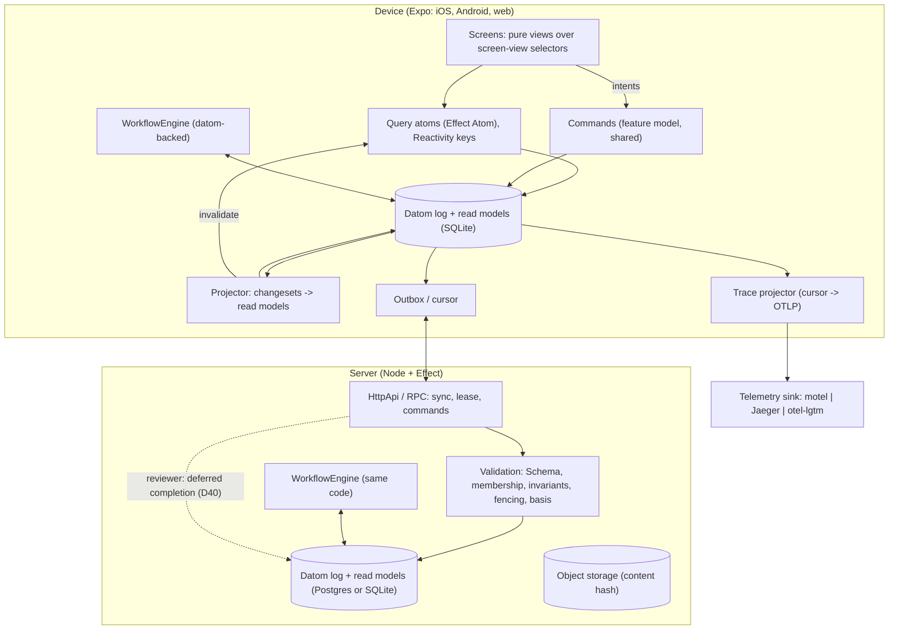

# Architecture

The technical design behind the decisions in [02-decision-log.md](02-decision-log.md). Everything here is
unverified until its gate in [06-qualification-gates.md](06-qualification-gates.md) passes.

## 1. Big picture



The diagram is simplified: commands go through the shared command function and outbox (D36), not a raw write to the log. The reviewer's path is a second actor on the server that writes a deferred-completion datom (D40); it is shown as a dashed edge.

## 2. The datom

```
[e, a, v, tx, op, cs]
 e   entity id (branded Schema type, may encode a parent: O{org}/L{list}/T{todo})
 a   attribute (namespaced, declared in a feature model Schema, never renamed or retyped)
 v   value (Schema-encoded; personal attributes encrypted per subject)
 tx  HLC id of this datom (ULID-shaped, sortable, unique, the datom's identity)
 op  assert | retract
 cs  changeset id; cs == tx means the datom commits itself
```

Each datom is its own transaction (one datom on the wire and in storage). Atomicity across several datoms comes
from changesets (section 4).

Every changeset has exactly one **envelope** (D58): actor, device, lease epoch (if any), `traceId` / `spanId` /
`sampled`, command name. The changeset is the unit of intent (one command, one actor, one trace), so the envelope is
**keyed by `cs`, always, with one mechanism whatever the changeset size**:

- Stored as one fixed-shape record in the `changesets` table keyed by `cs`, not as datoms.
- On the wire it travels with the commit datom, or with the datom itself when `cs == tx`.
- A self-committed datom is a changeset of one: it has its own envelope record, and stays one datom.
- Queryable by joining datoms on `cs`.

## 3. Time: the hybrid logical clock (D33')

```
mint():
  now = correctedClock()                  // server-corrected physical time
  if now > last.pt: tx = (now, 0)         // normal case
  else:             tx = (last.pt, last.c + 1)
  last = tx; persist(last)

receive(remote):
  last = max(last, remote)                // never mint below anything seen

correctedClock():
  within a boot session: serverOffsetAnchor + monotonicElapsed (performance.now)
  after reboot:          wallClock + persisted offset, clamped to >= last persisted HLC
```

- Encoding: 48-bit milliseconds, 16-bit counter, remaining bits random plus device id. Lexicographically sortable.
- Server rejects `tx` too far in the future and flags the gap so it shows up in the trace. The skew bound is
  indicative (web-interview used 5s); P04 picks the actual bound.
- The offset and last HLC are persisted in SQLite.

## 4. Changesets (D35'')

```
[ev1  :evidence/title   "Q3 backup log"  tx1  +  cs7]
[ev1  :evidence/file    "blob:9f2..."    tx2  +  cs7]
[fd2  :finding/status   :closed          tx3  +  cs7]
[cs7  :changeset/commit {n:3, hash, basis}  tx4  +  cs7]      envelope(cs7) travels alongside
```

- **Lifecycle**: a changeset is open until a write-once commit or abort datom (attribute names illustrative until
  the P05 vocabulary pass), or TTL expiry. Open changesets are drafts (review-before-apply is native).
- **Manifest**: the commit carries the member count and hash (and file references, D43). The server and every
  projector apply the changeset only when the manifest is satisfied.
- **Ordering**: conflicts use the commit `tx` (when the change took effect). Member `tx` orders within the changeset.
- **Basis check**: the commit records the log position it was built on. For every touched attribute the server
  checks changes after the basis and applies that attribute's policy (D34): LWW wins, write-once rejects, human
  conflict raises a conflict datom.
- **Views**: committed (everyone) and committed + my open changesets (the author's draft view).
- **Shorthand**: `cs == tx` is self-committed and needs no commit datom.
- **Journal entries** of the workflow engine are always self-committed: steps become visible as they complete.

## 5. Entities, ids and lifecycle (D38)

- **Defining attribute**: one per entity type. Asserted = exists, retracted = deleted (subtree hidden), re-asserted =
  restored with its other attributes.
- **Parent in id** only for strict composition: `O{org}/` root, list -> todo, order -> line,
  `O{org}/W{exec}/A{activity}#{attempt}` journal entries, `O{org}/W{exec}/D{name}` deferreds.
- **References** (attributes) for anything that can move or is many-to-many.
- **Projection rule**: an entity is visible iff its defining attribute is asserted and its owner (id parent or owner
  reference) is visible.
- **Orphans**: writes to user-content types under a deleted parent raise a human conflict (never silent loss).
- **Prefix power**: authorization, compaction, export and Reactivity keys all work by prefix. Sync of the first
  protocol is full-store per organization (one cursor), not prefix subscriptions.

## 6. Conflict policies (D34)

Declared per attribute in the feature model Schema:

| Policy | Used for | Behaviour |
|---|---|---|
| LWW | domain scalars (title, note, amount) | highest commit `tx` wins |
| write-once, fenced | journal facts, deferred completions, lease grants, changeset commit/abort | first valid write under a valid lease wins, others rejected |
| human conflict | references, evidence attachments, approvals, user content | both values kept, a conflict datom raised (attribute name illustrative until the P05 vocabulary pass), a person resolves |

## 7. Commands and validation (D36)

```
command: (readModel, intent) -> Effect<Changeset, DomainError>     // pure, in features/<f>/model
client:  run command -> apply locally (optimistic) -> append to outbox
server:  receive changeset -> Schema -> membership/authorization (O{org} prefix) -> invariants
         -> lease fencing -> basis check -> accept | reject(typed error)
client on reject: rebuild read models from confirmed datoms, reapply remaining outbox, trace the rejection
```

## 8. Storage and projections (D37)

- SQLite (device, Node) and Postgres (server) share one contract through Effect `SqlClient`. D58 decided a
  `changesets` table for envelopes. Other table and column names below are **indicative** until P04 confirms them:
  - `datoms(e, a, v, tx, op, cs)` append-only, indexes EAVT and AEVT (and on `cs`).
  - `changesets(cs, state, commit_tx, basis, manifest, actor, device, lease_epoch, trace_id, span_id, sampled,
    command)`: one row per changeset, including self-committed datoms (`cs == tx`).
  - typed read-model tables per entity type, Schema-defined, updated incrementally inside the same SQL
    transaction that applies a committed changeset.
  - `sync_cursor`, `hlc_state`, `outbox`.
- Read models are disposable: rebuild from the log at any time; never migrated (D44).
- Snapshots and compaction only past a horizon every device has acknowledged; finished workflow journals archived
  to the server.
- Analytics: a projector exports to Parquet / DuckLake for DuckDB. DuckDB is never the durable log.
- Log store is one Effect service with implementations `sqliteNative` (op-sqlite), `sqliteWasm` (OPFS),
  `sqliteNode`, `postgres`, all passing the same conformance suite (optionally `sqlcipher`, D50).

## 9. The durable execution engine (D10, D39, D40, D24)

Our implementation of Effect's `WorkflowEngine.Encoded` interface (`register, execute, poll, interrupt, resume,
activityExecute, deferredResult, deferredDone, scheduleClock`, see research/01 section 2) that stores everything as
datoms. Attribute names in this table were pinned by P06 (D44: a shipped name cannot be renamed). Id shapes
(`O{org}/W{exec}`, `/A{name}#{attempt}`, `/D{name}`, `/C{name}`) were decided.

| Engine fact | Datom |
|---|---|
| execution started | `[O{org}/W{exec} viviefs/workflow/started {name, payload} ...]` (defining attribute) |
| activity result | `[O{org}/W{exec}/A{name}#{attempt} viviefs/activity/exit <encoded Exit> ...]` write-once |
| deferred completion | `[O{org}/W{exec}/D{name} viviefs/deferred/exit <encoded Exit> ...]` write-once |
| clock scheduled | `[O{org}/W{exec}/C{name} viviefs/clock/wake-at {wakeAtMs, ...} ...]` + local notification |
| lease | `[O{org}/W{exec} viviefs/lease/holder {device, epoch, expiresAtMs}]` LWW, fenced by epoch |
| execution result | `[O{org}/W{exec} viviefs/workflow/result <encoded Exit>]` |

- **Replay**: re-run the workflow body; `activityExecute` returns the stored exit when present.
- **Determinism**: time, randomness and ids only inside activities (lint rule D26).
- **Versioning**: by workflow name; activity names unique and stable within a version.
- **Wake-ups**: sweep due clocks and pending resumes on launch and foreground; opportunistic background task;
  notification actions complete deferreds; push from the server is only a hint.
- **Browser**: Web Locks leader tab runs the engine (D25). Other tabs render and forward events to the leader over
  BroadcastChannel. Each browser profile counts as one device for leases.
- **Server**: same engine over Postgres; Effect Cluster is the scale-out path later.
- **Leases**: a device must hold the execution lease to run it; the server rejects journal writes from a stale epoch.

Known Effect constraints (research/01): `Workflow` hashes ids with `crypto.subtle.digest` (needs a polyfill on
Hermes); activities that suspend re-run on replay; `withCompensation` only for top-level effects; `DurableClock`
sleeps up to 60s run in memory.

## 10. Sync (D13, D21, D36)

- **Up**: outbox of datoms (self-committed and changeset members + commits), idempotent by `tx`.
- **Down**: one cursor stream (server sequence) of accepted datoms for the whole organization the identity is a
  member of. Prefix subscriptions (partial sync) are later, not part of P09.
- **Server**: validates per changeset (section 7), enforces leases, rejects unknown attributes with a typed upgrade
  error (D44). Isolation is server-authoritative (D18).
- **Transport**: Effect RPC, append-and-acknowledge (Q21). P09 confirms this; do not list HttpApi/SSE/WebSocket as
  alternatives in the protocol.
- **Later, because the replica is the whole org** (not P09): history consolidation (a device cannot keep an
  unbounded org log; sits next to D37's compaction horizon) and client-side data access (the user must still only
  see and do what they are allowed, on a replica that contains the org).
- Effect EventLog informed the design (server sequence + entry-id dedup) but is not used (research/03).

## 11. Tracing (D32, D45')

- Trace context (`traceId`, `spanId`, `sampled`) is stored in every changeset's envelope (D58).
- A trace projector reads the log from its own cursor and emits spans with deterministic ids derived from
  `executionId + activity + attempt` (D32). Extending that scheme to changeset ids for commands is new, not
  grilled; keep it only if P10 needs command spans, otherwise drop it. Replays emit nothing new for stored results;
  new attempts link to previous ones.
- Export through Effect's native OTLP exporter (`effect/unstable/observability`, JSON serialization, `fetch`), no
  `@opentelemetry/*` dependencies. Killed apps lose nothing: export resumes from the cursor.
- Live spans (`Effect.withSpan`, `Effect.fn`) inside activities are parented to the durable spans.
- Sinks: motel (default), Jaeger, otel-lgtm, chosen by endpoint config only.

## 12. UI (D11, D12, D41, D42)

- Three state owners: domain facts (log -> read models -> query atoms), interaction state (machine or atom, decided
  by gate P08), in-flight text (component state until settled).
- Screens are pure views over a screen-view selector (read model + UI state + status). Storybook with fakes, scoped
  to web and shared components.
- Query atoms declare Reactivity keys (prefixes + attributes); the projector invalidates exactly what changed.
  Two variants: committed, and committed + my open changesets. A dev-mode check warns when an atom returns different
  data without having been invalidated.
- Workflows own durable progress; the UI completes deferreds via commands and rebuilds from scratch after a kill.

## 13. Files (D43) and privacy (D50, D51)

- Files by content hash; upload is an idempotent activity; commits wait for the file on the server.
- Device data at rest: OS file protection baseline, SQLCipher option.
- Personal attributes: crypto-shredded per subject.

## 14. Platform notes (research/02, research/05)

- Effect v4 core runs on Hermes V1 with Expo's `TextDecoder`; add `crypto.getRandomValues` and
  `crypto.subtle.digest` polyfills (expo-crypto or react-native-quick-crypto).
- Metro rejects the dynamic `import()` in `effect/unstable/sql/Migrator.js` (Effect-TS/effect#6347). The babel
  plugin in `research/rn-check/babel.config.js` stubs it.
- Prefer deep imports (`effect/Effect`) or Expo tree shaking: the barrel adds about 2.7 MB to an iOS bundle, deep
  imports about 0.6 MB.
- All of this was measured on SDK 56 / RN 0.85 and must be rerun on SDK 58 (gate P01).
