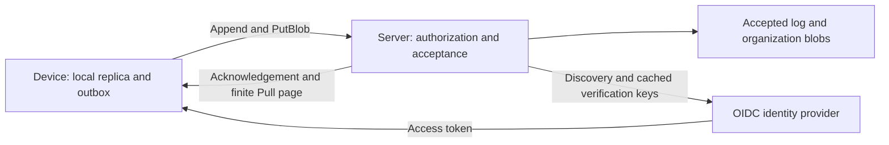
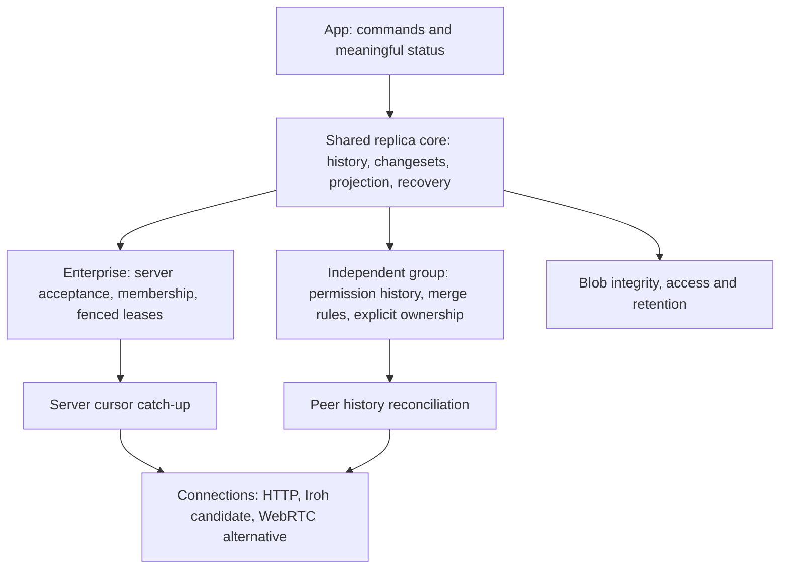

# Enterprise and P2P communication architecture

Research record, 2026-09-30. Discussion material, not an ADR, implementation plan or qualification claim.

The confirmed goal is **both enterprise authority and a genuinely server-independent mode**. This document updates the [September 28 research](2026-09-28-communication-architecture.html) into one reusable discussion base. Repository inspection is from September 30, HEAD `a970df75cd0fe9547bddcc1332cc725ac65c2577`, with substantial unrelated work in progress. External sources were researched September 28; Iroh release, browser and native-binding documentation, libp2p browser connectivity and MoQ status were refreshed September 30. Other external findings retain their September 28 date. No runtime experiment or gate was run for this research.

## 1. Architectural position

**Keep the current enterprise protocol and investigate a shared replica core with two explicit authority models. Evaluate Iroh as connectivity, independently of the decision about who may accept changes.**

The interesting architectural boundary is between transporting information, reconciling durable history and deciding what that history means. A direct encrypted connection cannot replace membership, acceptance, conflict rules or workflow ownership. Conversely, an authoritative enterprise server can communicate over Iroh without becoming decentralized.

The recommended hypothesis is:

- Share commands, datoms, complete changesets, read models and recovery mechanisms where their contracts remain valid.
- Preserve enterprise acceptance, server cursors, OIDC and fenced leases.
- Give independent groups their own trust establishment, permission history, reconciliation and explicit rules for exclusive work.
- Keep HTTP as a complete enterprise path. Compare Iroh with WebRTC/libp2p for peer connections; do not make either the domain model.

“Server-independent” should mean that the original application operator is unnecessary for the agreed operations. Optional relays, discovery services and storage replicas may improve availability, provided they are replaceable and do not acquire application authority. Operation with **no infrastructure whatsoever**, especially between browsers, is a stronger requirement that remains undecided.

This is a hypothesis to discuss and qualify. The current [scope freeze](../plan/bootstrap/10-open-items-and-risks.md) still specifies full-organization sync, one cursor and Effect RPC. This research changes none of it.

## 2. What ViViEfs currently communicates

The existing protocol is an **acceptance protocol**, not just database copying. A device submits changesets; the server validates them, determines accepted history and supplies a sequence for catch-up. The [glossary](../../GLOSSARY.md), [sync ADR](../adr/0017-sync-outbox-and-cursor-stream.md) and [lease ADR](../adr/0014-leases-fencing-and-server-authority.md) establish that model.

The arrows to the identity provider do not imply an authentication round trip for every request: token verification uses cached keys.

| Responsibility | Inspected behavior | Architectural implication |
| --- | --- | --- |
| Application calls | `Append`, `Pull`, `PutBlob`, `CompleteDeferred`, `Caller`; bearer authentication covers the RPC group | Authentication is central to the present protocol |
| Upload | Organization, numeric basis, envelope and datoms; acknowledgement contains a cursor | Acceptance refers to an authoritative history |
| Download | `Pull` is declared streaming but currently emits one finite page; no explicit page-size bound in this path | It is not a standing subscription or a bounded peer reconciliation protocol |
| Progress | One confirmed cursor per organization, drawn from the server log sequence | It cannot summarize arbitrary independent histories |
| Validation | Organization, membership, actor, attributes, manifests, basis, blobs and lease checks; typed rejection | Retain these guarantees when changing connections |
| Workflow | Self-committed journal writes enter the device log after server acknowledgement | Current durable execution is not server-independent |
| Composition | Effect RPC, HTTP `/rpc`, NDJSON; PGlite in the lab and in-memory blobs | Production TLS, durable blob hosting and binary transfers need separate decisions |

These are directly inspectable in the [RPC contract](../../libs/sync/protocol/src/rpc.ts), [client](../../libs/sync/client/src/client.ts), [server](../../libs/sync/server/src/server.ts) and [evidence-server composition](../../apps/evidence-server/src/server.ts). The server validates submitted datoms; this should not be described as rerunning the original command or proving every possible business invariant.

P09 qualified append/acknowledge, replication and rejection. **P11 is now Qualified**, unlike the September 28 research snapshot: its evidence covers token validation, membership, actor checks, server-only attributes, revocation, acceptance time, organization-scoped blobs and sign-in on iOS simulator, Android emulator and web. The [September 28 P01-P11 closure](../evidence/2026-09-28-p01-p11-closure.md) passed on `59b74a9a`. The [current handover](../plan/next-session.md) records a later sequential pass on `54e724786`, followed by input changes making gates stale. Historical qualification is not a claim that today's working tree was requalified. No ADR is yet Accepted and no pattern is delivered under the current delivery rules.

[P11's limits](../evidence/2026-09-28-p11.md) remain consequential: physical devices and TLS were not measured; device labels are unauthenticated; roles are carried but not enforced; who may take over an execution remains unspecified; stored history is trusted, not cryptographically provable. Membership revocation applies on the next server call with a still-valid token. It cannot erase an offline replica's knowledge.

## 3. Compare technologies at the layer they own

| Option | Strong contribution | What remains ViViEfs' responsibility | Research position |
| --- | --- | --- | --- |
| Effect RPC over HTTP | Typed calls, failures and streams in the existing Effect composition | Peer discovery and independent acceptance | Retain for enterprise |
| Iroh | Cryptographic endpoint addressing, QUIC, direct paths and encrypted relay fallback | Authorization, history reconciliation, acceptance and workflow ownership | Leading native connectivity candidate |
| libp2p with WebRTC | Modular peer networking and a documented direct browser path | Domain semantics and platform qualification | Strong alternative when browser peers dominate |
| Bare WebRTC / WebTransport | Browser peer data channels / client-server streams and datagrams | Signaling, durable replication and trust | Use for a specific connection requirement |
| Automerge | Document CRDTs and transport-independent synchronization | Enterprise validation and exclusive effects | Benchmark independent semantics; possible bounded document use |
| iroh-docs | Signed entries, reconciliation, blob and gossip composition | Fit with changesets, basis, rejection and SQL projection | Evaluate as a replicated-store choice |
| Holochain | Agent-centric history and distributed validation | Compatibility with the existing stack and authority model | Architectural comparison, not a transport replacement |
| MoQ | Prioritized publish/subscribe delivery for latency-sensitive content | Durable acceptance, replay and causal correctness | Defer until a concrete media requirement |

Primary sources: [Iroh](https://docs.iroh.computer/), [libp2p browser connectivity](https://libp2p.io/docs/webrtc-browser-connectivity/), [WebRTC](https://www.w3.org/TR/webrtc/), [WebTransport](https://www.w3.org/TR/webtransport/), [Automerge concepts](https://automerge.org/docs/reference/concepts/) and [network sync](https://automerge.org/docs/tutorial/network-sync/), [iroh-docs](https://docs.iroh.computer/protocols/documents), [Holochain validation](https://developer.holochain.org/concepts/7_validation/), [MoQ draft](https://datatracker.ietf.org/doc/draft-ietf-moq-transport/).

These are not interchangeable competitors. A CRDT can use Iroh connections; an authoritative server can use libp2p; a peer network still needs a replication protocol. Database read-sync products were withdrawn when ViViEfs adopted one datom log. Reopening that decision would be a separate architectural change, not a shortcut to P2P ([ADR-0017](../adr/0017-sync-outbox-and-cursor-stream.md)).

### Iroh's strongest fit and its limits

The [July 9, 2026 release announcement](https://www.iroh.computer/blog/the-road-to-iroh-1-0) says Iroh 1.0 shipped; its [release policy](https://docs.iroh.computer/about/release-policy) describes compatibility and maintenance commitments. This strengthens the core transport's candidacy. It does not establish production fitness for every protocol, binding or Expo composition, and this research claims no independent security audit or performance comparison.

[Swift](https://docs.iroh.computer/languages/swift) and [Kotlin](https://docs.iroh.computer/languages/kotlin) provide documented native paths. The [JavaScript binding](https://docs.iroh.computer/languages/javascript) is Node-oriented; Hermes compatibility cannot be inferred. A narrow native integration is plausible, but lifecycle, cancellation, binary copying, memory and suspension require measurement.

The [browser documentation](https://docs.iroh.computer/languages/wasm-browser), rechecked September 30, still says browser connections traverse relays and there is no provided browser npm package. That can support independence from an application authority with replaceable infrastructure. It does not satisfy direct browser-to-browser operation without a relay. The [libp2p browser guide](https://libp2p.io/docs/webrtc-browser-connectivity/) offers a direct WebRTC path, but signaling/discovery and relay assistance remain relevant; its demonstration's GossipSub discovery is explicitly not a production-scale recipe.

The [enterprise network guide](https://docs.iroh.computer/configuring-networks) also matters: ordinary HTTPS permission does not guarantee WebSocket-compatible relay egress. Private infrastructure and proxy policy need deliberate deployment choices. Preserve a working HTTP route through restrictive enterprise networks.

Evaluate Iroh protocols separately. [iroh-blobs](https://docs.iroh.computer/protocols/blobs) offers BLAKE3 content identity, verified ranges and resumable transfer, attractive for evidence files. ViViEfs' [current blob contract](../adr/0021-files-by-content-hash.md) uses `blob:` plus SHA-256: adopt versioned identifiers or a verified mapping, not a silent hash replacement. [Gossip](https://docs.iroh.computer/connecting/gossip) can announce new material; durable reconciliation must recover missed announcements. iroh-docs brings its own replicated data model, so placing it beneath another authoritative log risks two sources of truth.

MoQ remains an Internet-Draft, revision 21 dated September 8 at the September 30 check. The predecessor's Iroh/MoQ direction, summarized in the earlier research, is historical intent rather than a qualified ViViEfs baseline. Neither a modern transport nor a datom set proves convergent application behavior.

Licence snapshot from the primary repositories: [Iroh](https://github.com/n0-computer/iroh) and [js-libp2p](https://github.com/libp2p/js-libp2p#license) declare MIT/Apache-2.0 alternatives, [Automerge](https://github.com/automerge/automerge) MIT, [Holochain](https://github.com/holochain/holochain#license) CAL-1.0. Exact artifacts and dependencies require licence review before adoption; this record adds none.

## 4. A candidate reference architecture

These are responsibilities, not proposed package names. The shared core must prove deterministic projection and complete changeset visibility under each authority model. It should expose distinct states: saved on this device, durably received elsewhere, accepted by enterprise authority, or requiring conflict resolution. A single “synced” state would hide different promises.

Three deployments make the proposal concrete:

1. **Enterprise hub:** devices retain today's outbox and cursor behavior. The server authenticates, authorizes and accepts changesets. Durable storage and production availability remain operational responsibilities.
2. **Enterprise with peer exchange:** devices exchange permitted blobs and independently verifiable accepted history. They can forward proposals but cannot accept them for the enterprise. Server catch-up supplies authoritative omissions and current membership.
3. **Independent group:** invited devices establish a trust root, retain signed permission history and reconcile valid changesets without mandatory OIDC or server acknowledgement. Optional storage replicas provide asynchronous delivery and backup without deciding validity.

For the independent mode, start the discussion with evidence capture, file exchange and agreed mergeable attributes. Shared exclusive activities need a separate ownership rule. This scope makes independence useful while exposing where ERP invariants require coordination.

Effect's [RPC protocol seam](../../repos/effect/packages/effect/src/unstable/rpc/RpcClient.ts) and ViViEfs' `SyncRpc` service offer useful separation. An Iroh implementation is not already qualified. Reusing RPC over an Iroh stream would require framing, cancellation, errors, flow control and version tests. Keep domain validation in the common core where possible; establish canonical signing bytes regardless of whether other participants initially use TypeScript.

## 5. Guarantees that determine the architecture

### Progress, causality and convergence

One server cursor cannot describe two independently created histories. Taking the larger of two local sequence numbers can lose information. Independent replication needs a missing-history summary, such as per-writer progress with gap detection, a causal graph or content-set reconciliation. Receipt, causal dependencies and acceptance are separate concerns.

The numeric basis and projector must therefore be reviewed alongside transport. Re-prove LWW, human conflict, defining-attribute lifecycle, write-once rules and manifests against arbitrary arrival order: incremental projection must equal a full rebuild of the same valid history. An HLC does not prove honest wall-clock time or permission before revocation. A malicious future clock must not win indefinitely. Current contracts are in [ADR-0007](../adr/0007-hybrid-logical-clock.md), [ADR-0008](../adr/0008-single-datom-transactions-with-changesets.md) and [ADR-0009](../adr/0009-per-attribute-conflict-policies.md).

Converging data does not automatically preserve business invariants. Two devices can append observations offline and retain both; they cannot each promise exclusive use of the same remaining resource without another rule. [Invariant-confluence research](https://www.vldb.org/pvldb/vol8/p185-bailis.pdf) gives a principled criterion for locating coordination.

### Workflow ownership and side effects

Retain server-fenced leases in enterprise mode. Independent alternatives are explicit ownership with acknowledged handoff, a stable quorum, or duplicate execution only where the external target reliably deduplicates an agreed idempotency key. Explicit ownership is the simplest initial hypothesis; lost-device recovery must not pretend that minting a larger epoch offline establishes exclusivity.

[Raft](https://raft.github.io/raft.pdf) needs a majority and assumes non-Byzantine participants. It is not automatically appropriate for intermittently connected phones or hostile members. Rejecting a stale journal write cannot reverse an already executed payment; the external target must enforce the necessary idempotency or fencing.

### Durable trust and offline revocation

[Iroh security](https://docs.iroh.computer/concepts/security-privacy) authenticates endpoint keys and encrypts connections, including relayed connections. It does not identify a ViViEfs person or authorize organization replication. Keep person identity, device signing keys, transport keys and provider-account mapping distinct.

Forwarded enterprise acceptance needs independently verifiable evidence. A candidate design signs immutable authored content and attaches a separate server acceptance receipt. Otherwise adding `acceptedAt` changes what the device signed. Proofs must bind organization, key epoch, protocol/schema version, changeset manifest, causal context and relevant permissions. These are proposed requirements, not additions to the pinned envelope or attributes.

Independent groups need invitation, delegation, removal and recovery rules. Do not distribute the enterprise server-only account mapping or forward bearer tokens to arbitrary peers. An isolated device cannot know about a recent revocation; decide whether concurrent changes are valid, quarantined or require fresh authority evidence. Self-asserted time cannot settle that dispute, and previously disclosed plaintext cannot be recalled.

Connection encryption and SQLCipher also do not establish encrypted group replication. Blind storage replicas need application ciphertext and key distribution. Align signatures, hashing, subject keys and erasure with [ADR-0023](../adr/0023-data-at-rest-and-crypto-shredding.md): **P15 is encrypted store, P16 crypto-shredding, P17 browser engine leader**. None proves deletion from a malicious recipient that kept plaintext.

### Availability, scope and recovery

A relay forwards connections; it is not automatically a durable mailbox. Offline recipients need overlapping availability, another retaining replica or export/import. Independent browser ownership also depends on obtaining and retaining the application itself when the original host disappears.

Full-organization replication is deliberate today, with known growth and local-read risks. Peer distribution makes scope decisions more consequential. Partial replication needs a rule for changesets whose dependencies cross sharing boundaries. Content integrity does not prove permission to read or a promise to retain bytes.

Bound reconciliation, resume transfers, test mobile suspension and define replica retirement before compaction. The present server log remains uncompacted pending trust work. Optional backup replicas must distinguish data recovery from identity/key recovery; losing the only copy cannot be solved by a networking library.

## 6. Discussion frontier and next evidence

Only the two-mode goal is confirmed. Recommended starting positions below are not approvals.

| Decision | Starting position | What would change the recommendation |
| --- | --- | --- |
| Infrastructure independence | No required application authority; replaceable relays and native LAN operation | Relay-free browser peers favor WebRTC/libp2p |
| Offline finality | Evidence and explicitly mergeable work | Scarce resources require allocated rights, coordination or reduced availability |
| Group governance | Invited groups with an explicit administrative trust root | Open membership or hostile administrators require a stronger threat model |
| Web ownership | Durable participating replica, documented connection limits | Gateway-only web weakens independence |
| Moving between modes | Explicit import/promotion with provenance and revalidation | Seamless switching needs authority-transition and fork rules |
| Loss and recovery | Separate data backup from identity recovery | No surviving copy or key means no recovery promise |

Discuss these through a field-team scenario: two devices lose connectivity, record evidence, receive conflicting permission changes and later reconnect. Then repeat with a lost device and an exclusive external action. Settle the guarantees before the wire codec.

The next evidence should be a paired exemplar with the same useful domain operation in both modes, preserving enterprise P09/P11 behavior. Its independent run must not contact hidden application authority or OIDC infrastructure. Compare Iroh and WebRTC/libp2p on physical native devices and target browsers, including internet-free LAN, restrictive NAT, blocked UDP, relay failure, network changes and suspension. Measure latency, resource use, battery and transfer recovery rather than inferring performance from transport design.

Exercise duplicated and reordered changesets, incomplete manifests, schema skew, hostile clocks, forged acceptance, conflicting identifier contents, revoked keys, missing blobs and long-offline recovery. For workflows, observe external effects across crashes and handoff. For independence, remove the original operator, replace infrastructure and restore a fresh authorized device.

Choose Iroh if native connections and verified large transfers are decisive and relayed browsers meet the requirement. Choose WebRTC/libp2p if direct browser connections are decisive. If both authority models cannot share a truthful acceptance contract, share lower-level mechanisms and retain separate acceptance contracts. The next lasting decision should be the authority and consistency contract, recorded through the normal ADR and qualification process.
