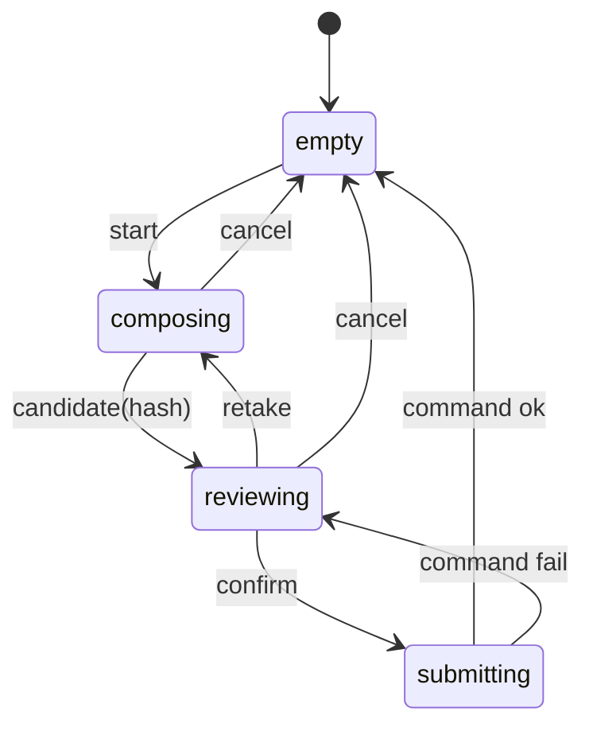
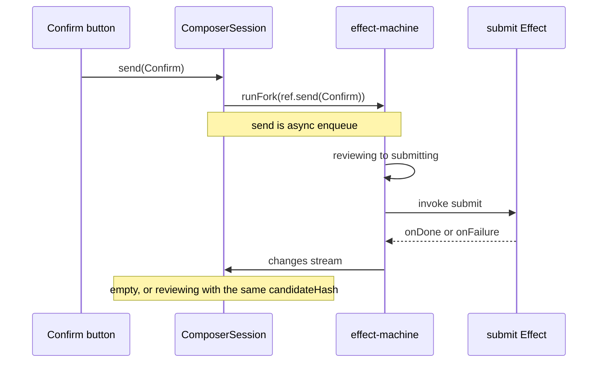

# IntentComposer

**IntentComposer** is the pattern name. This page is `intent-composer.md`.

## States

## Confirm

Confirm follows the effect-machine path. After success a command may mint a changeset. The composer is already empty.

